# **Tugas 1: Versioning**
## **Laporan Tugas Git**

**1.** **Fast-Forward Merge**

* **Step 1** - Melakukan inisialisasi menggunakan **`git init`**, **`git branch`** digunakan untuk melihat sedang berada di *branch* apa sekarang, lalu untuk **`git status`** digunakan untuk mengecek status *repository* lokal.
  ####
  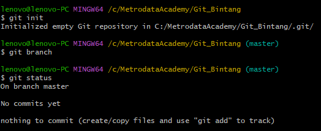
---
* **Step 2** - Ubah nama *parent class* menggunakan **`git branch -m master ParentBintangRevisi`**, **`git status`** digunakan untuk mengecek status *repository* lokal. Menambahkan *file* README.md ke dalam *branch* ParentBintangDivisi.
  ####
  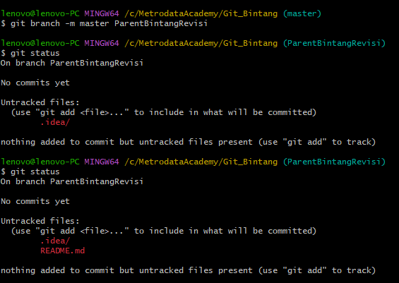
  ####
  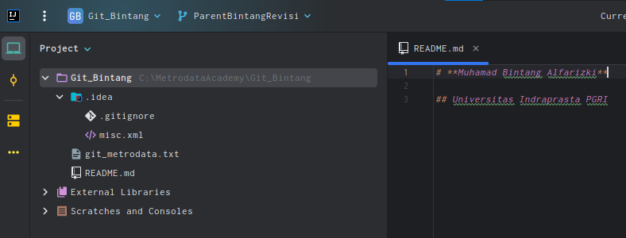
---
* **Step 3** - Menggunakan **`git add *`** untuk menambahkan *file* baru ke dalam *repository* yang baru dipilih. Menggunakan **`git commit -m "Add: README.md in Parent Class"`** untuk menyimpan apabila terjadi perubahan dan dilakukan pada *repository* jarak jauh, namun tidak bisa melakukan perubahan.
  ####
  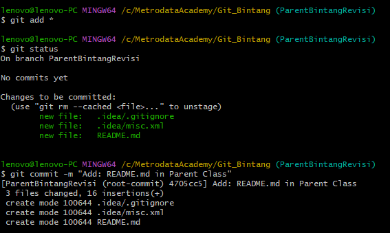
---
* **Step 4** - Menggunakan **`git checkout -b ChildBintangRevisi`** untuk membuat *child branch* dari *parent*. Lalu menggunakan **`git branch`** untuk mengetahui kita sedang ada di *branch* apa.
  ####
  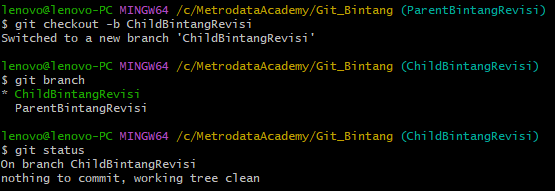
---
* **Step 5** - Pada *branch child*, kita melakukan perubahan pada *file* README.md, sehingga saat **`git status`**, ada keterangan **`modified:   README.md`**, lalu kita melakukan *commit* **`git commit -am "Modified file README.md in Child Class"`**, lalu memastikan bahwa semua dalam kondisi *clean* dengan **`git status`**.
  ####
  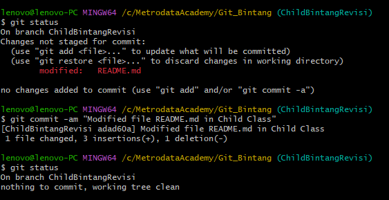
  ####
  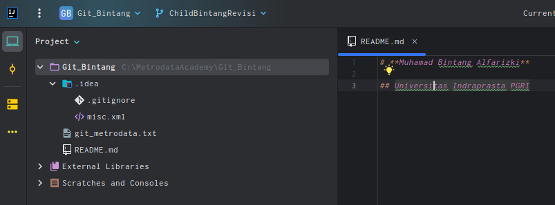
---
* **Step 6** - Pindah ke *branch parent* **`git checkout ParentBintangRevisi`** untuk membuat alias *graph* **`alias graph="git log --decorate --online --graph`** dan *graphs* **`alias graphs="git log --all --decorate --online --graph`**, ini digunakan untuk menampilkan *history commit* pada suatu *branch* dan semua *branch*.
  ####
  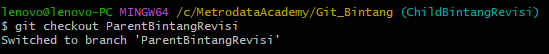
  ####
  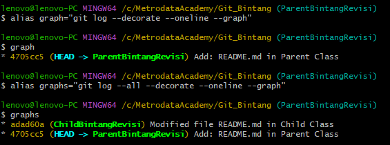
---
* **Step 7** - Menambahkan *file* `git_metrodata.txt` *ke branch* ChildBintangRevisi.
  ####
  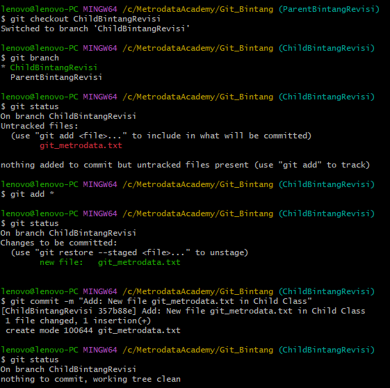
---
* **Step 8** - Di saat semua sudah sempurna, maka kita akan melakukan *merge* dari *branch parent*, untuk itu akan dipindahkan ke *branch parent* terlebih dahulu. *Branch child* akan di-*merge* ke *branch parent* **`git merge ChildBintangRevisi`**. Setelah itu saya mencetak kembali *graph* yang menunjukkan posisi *parent* dan *child* sejajar kedudukannya setelah *merge*.
  ####
  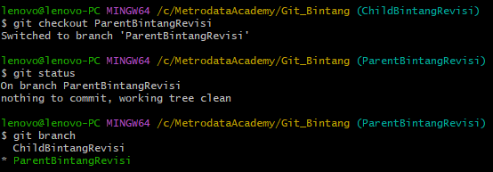
  ####
  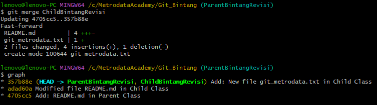
---
## **Terima Kasih :)**