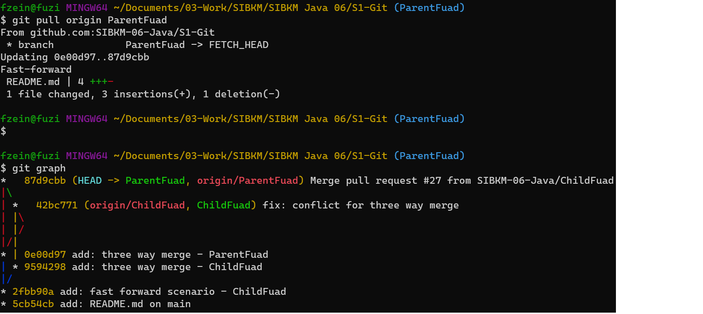

## Tugas Fuad - Git

### Tugas Fast Forward - branch ChildFuad

### Three Way Merge - ChildFuad

### Three Way Merge - ParentFuad

- git push => upload file local ke cloud
- git pull => download file cloud ke local

- reviewer => parent -> jangan sampai solved conflict
- assigness => child -> seharusnya solved conflict

- creator = write - read
- continous = read - write

## **`Laporan Tugas Git`**

### 2. Three Way Merge

- Hasil setelah pull request
  
