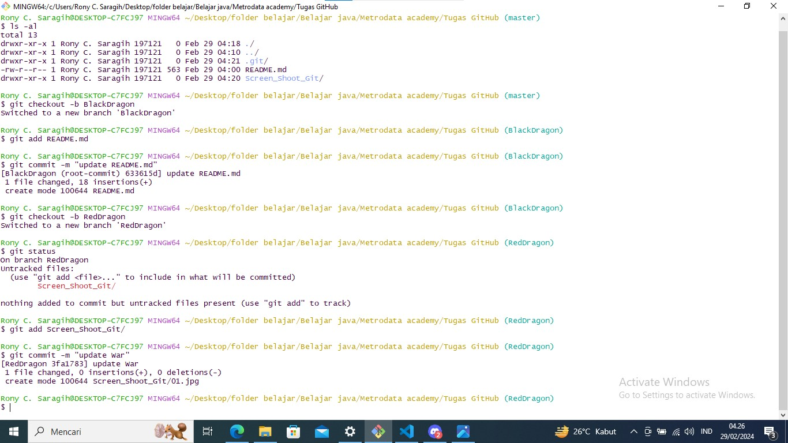
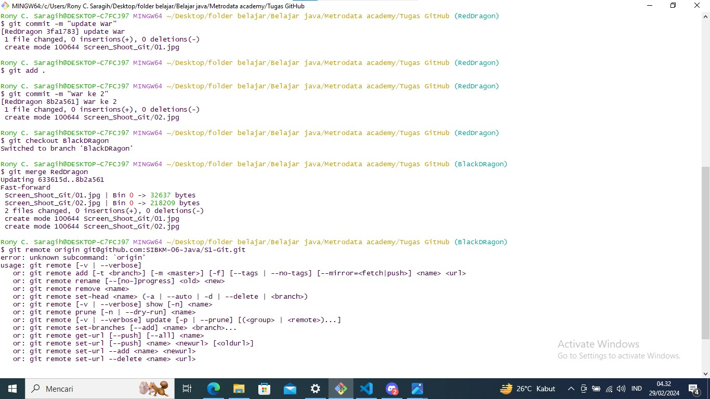

# Melakukan Fast Forward
 
 1. `Melakukan git init`

    

 2. ` beralih ke branch revisiParentRony,lalu membuat perubahan setelah itu beralih ke branch BlackDragon ` 
    `dan akan menggabungkan kedua branch menjadi satu dengan git pull`

    

 3. `menggabungkan antara dua buah branch`

    

# Melakukan Three Way Merge

1. `Melakukan git init`

   

2. `membuat branch baru dengan nama BlackDragon, membuat perubahan dan membuat branch baru`
   `dan juga mengubah isi dari brach`

   

3. `menggabungkan antara dua buah branch`

   

4. `Membuat dan sekaligus mengubah commit dari branch WhiteDraogon`

   

5. ` menggabungkan antara ketiga branch Satu samayang lain`

   

