# 1. Fast Forward

## Inisialisasi GIT
- Buatlah sebuah folder
- Klik kanan di dalam folder tersebut dan pilih git bash here
- 
- setelah gitbash terbuka ketikkan git init untuk inisialiasi
- 

## Add,Commit
- gunakan perintah git status untuk melihat adanya perubahan
- 
- "git add *" untuk menambahkan seluruh file yang ada ke dalam staging area
- 
- "git commit" untuk melakukan commit ke local repo
- 
- "git log" untuk melihat riwayat commit
- 

## Branch
- gunakan command "git checkout -b childRaihan" untuk membuat sekaligus berpindah ke branch baru
- 
- lakukan add dan commit seperti biasa
- bisa dilihat pada gambar dibawah hanya childParent saja yang berubah.
- 

## merging
- Sebelum melakukan merging pindahkan dulu ke branch parent nya
- gunakan command "git merge child" untuk melakukan merge dari parent ke child
- 
- diliat dari graphs posisi parent dan child sudah sejajar
- 

## Remote
- perintah pada gambar dibawah ini untuk menghubungkan repo lokal kita ke repo cloud di github
- 
- Kemudian kita akan melakukan push dari branch parent ke repo github
- 
- Lakukan juga kepada branch child
- 

# 2. Three Way Merging
## Membuat dan Solving Conflict
- Lakukan clone dari github(cloud) ke local repo
- 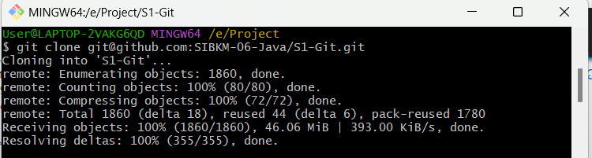
- kemudian masuk ke branch parent dan child
- 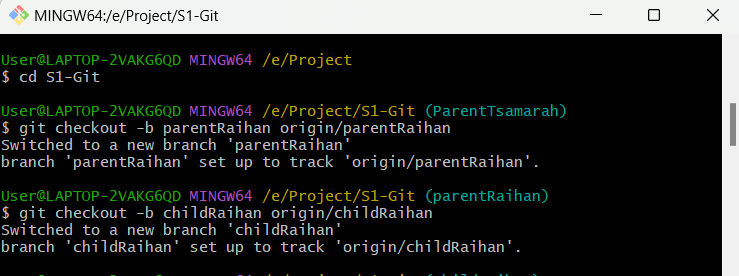
- Edit file readme.md di branch parent agar nantinya akan terjadi    
conflict dengan branch child
- 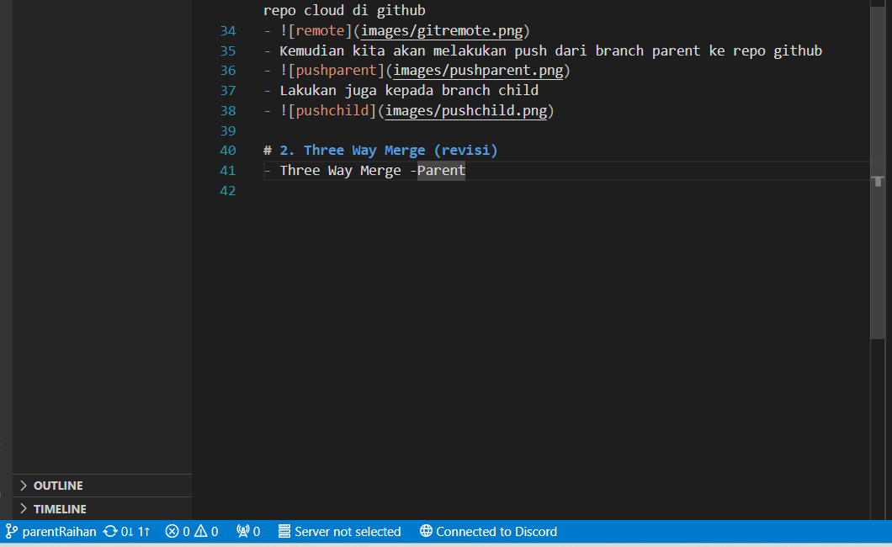
- Lakukan commit dan push pada branch parent
- 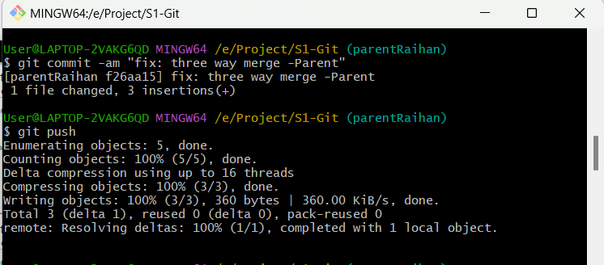
- lakukan hal yang sama pada branch child tapi jangan disamakan
- 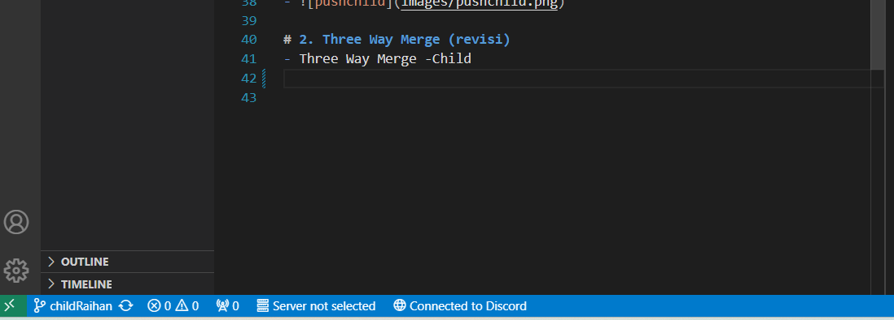
- lakukan commit.
- git pull dari branch child ke branch parent
- 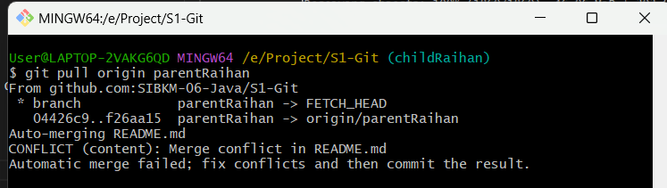
- Solve conflict dengan menggunakan vscode
- 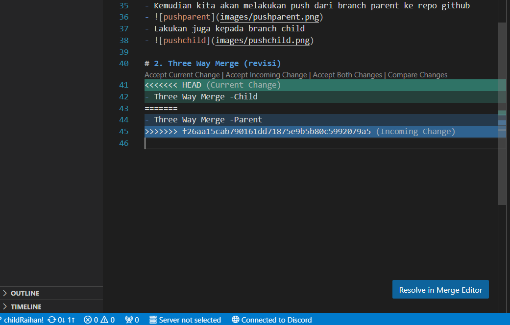
- Pilih accept both changes nanti akan menjadi seperti dibawah
- 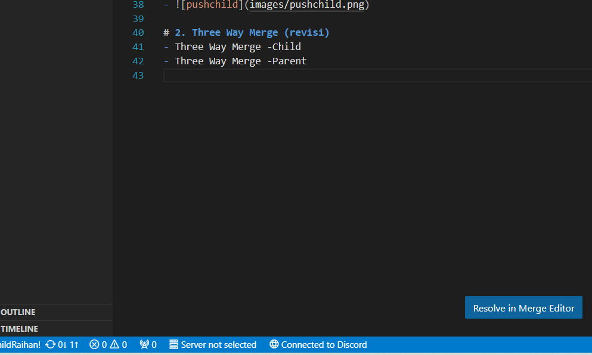
- Lakukan commit dan pull sekali lagi
- 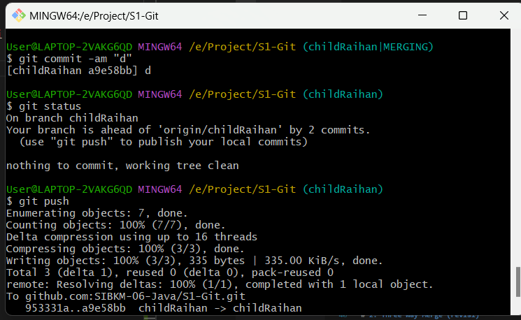

## Open Pull Request
- Buka repo di github dan lakukan open new pull request dengan branch parent sebagai base dan child parent sebagai subjek yang ingin dikomparasi
- 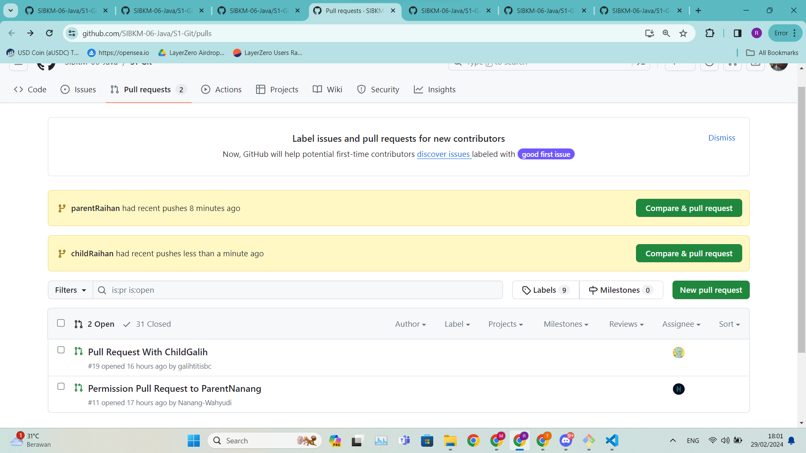
- 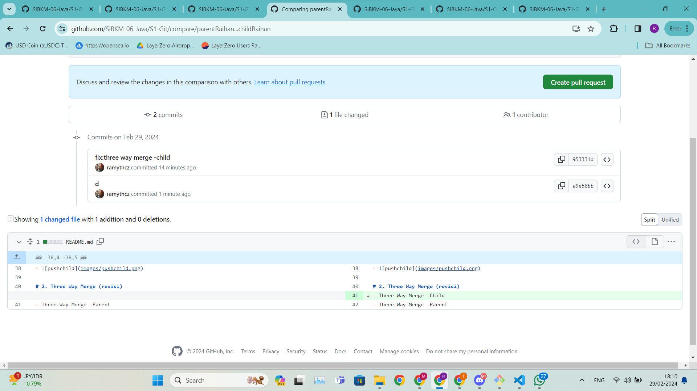
- set reviewer dan assignee
- 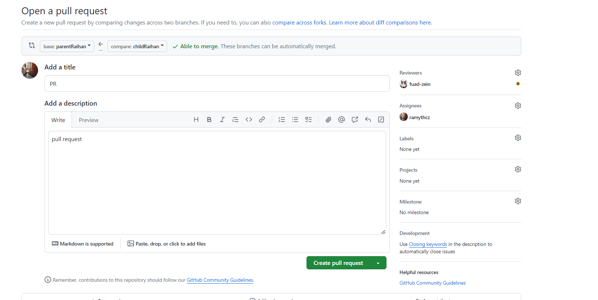
- Accept Merge (seharusnya ini tidak dilakukan sendiri tanpa persetujuan reviewer namun dalam kasus ini hanyalah uji coba saja)
- 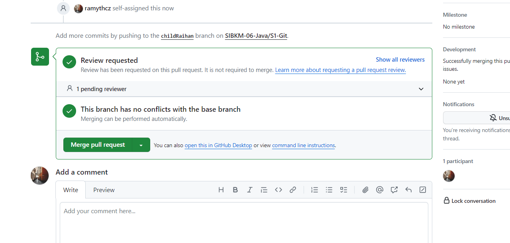