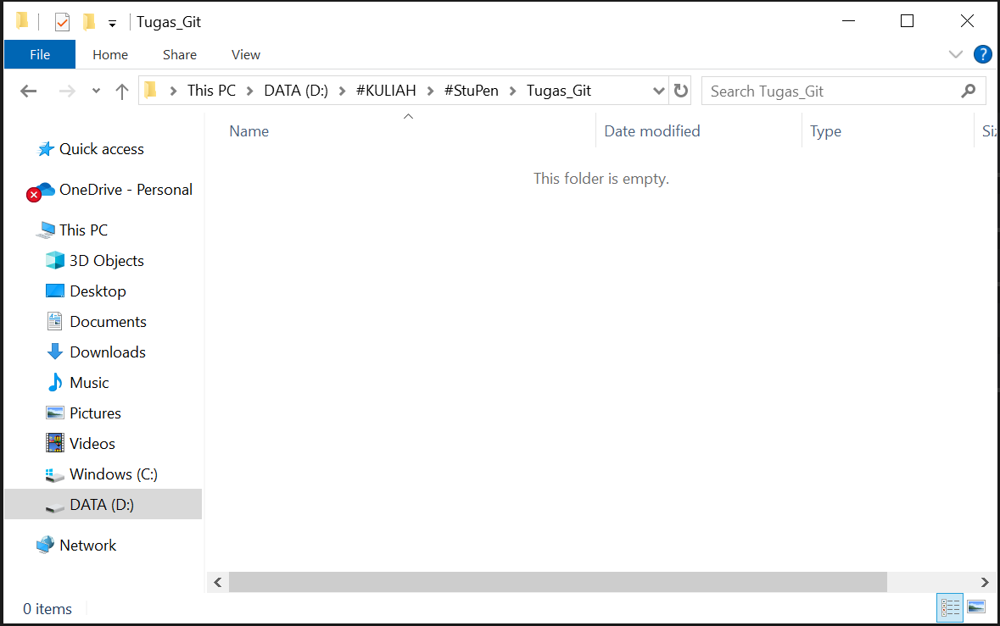

# SETYO ARDIKA PUTRA

### Langkah 1: Disini saya membuat folder baru terlebih dahulu.

### Langkah 2: Selanjutnya saya membuka GitBash dan mengarahkan ke directory path folder yang sudah dibuat pada tahap sebelumya. Setelah itu menghubungkan git dengan IDE code(visual code saya) dan "git init".

### Langkah 3: Selanjutnya saya mengecek list apa saja yang ada dalam folder directory ini. Sebelumnya saya sudah membuat file README.md jadi ada dalam list.

### Langkah 4: Selanjutnya saya disini mengcommit "add: README.md" pada git, lalu saya cek status dari repostory.

### Langkah 5: Saya menampilkan log dan membuat alias untuk "git log --all --decorate --oneline --graph" dan coba langsung menampilkan dari alias tersebut.

### Langkah 6: Disini saya merubah nama branch master menjadi 'ParentSetyo' dan membuat branch baru yaitu 'ChildSetyo'. Setelah itu langsung switch atau pindah ke ChildSetyo.

