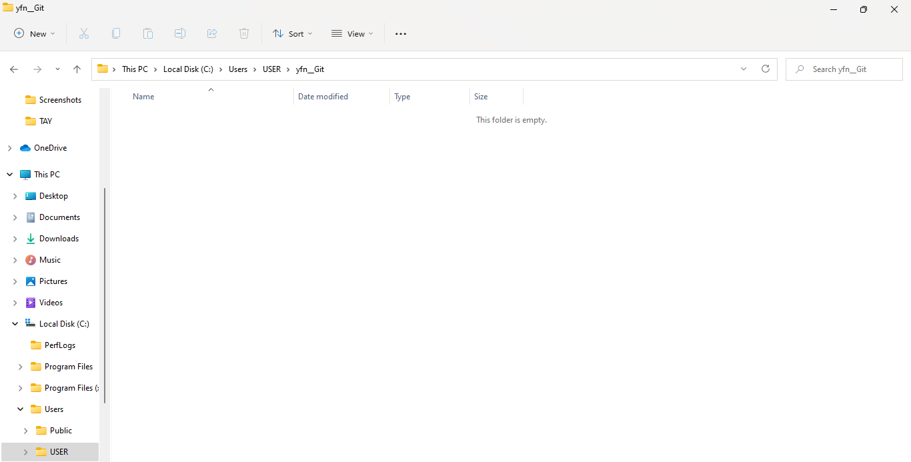
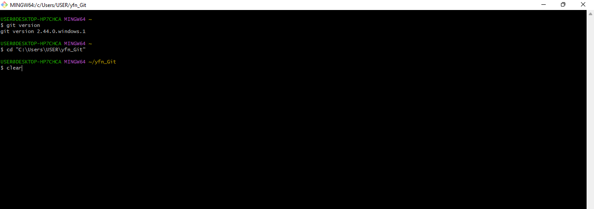
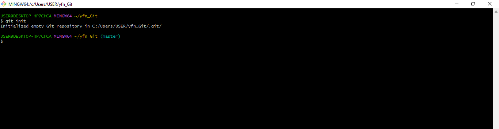
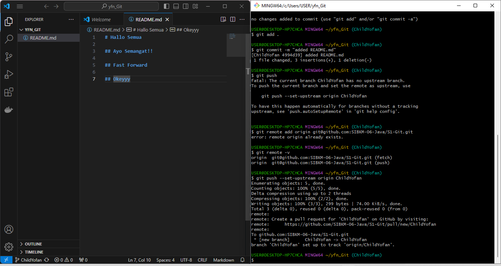
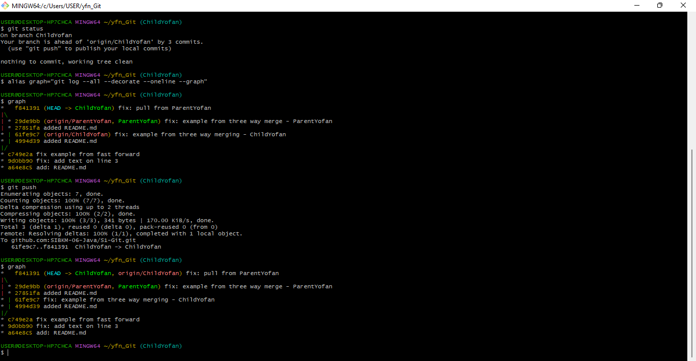
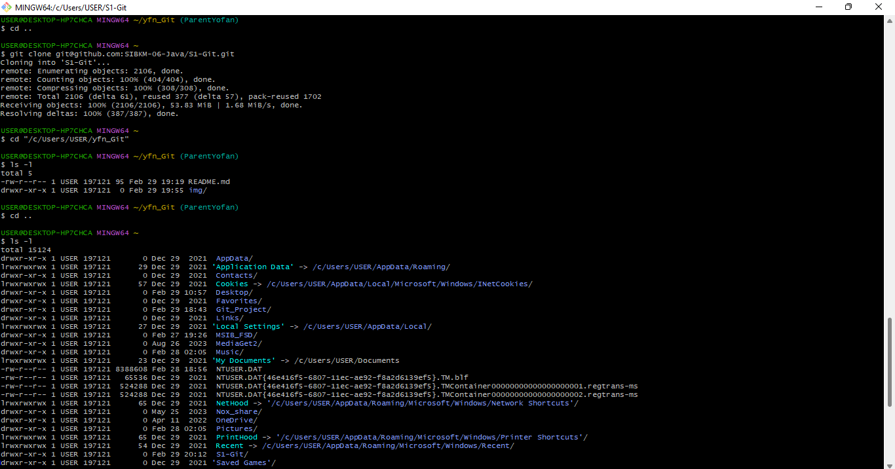

# Hallo Semua

## Ayo Semangat!!

## GIT
repo	  = folder project kita
commit    = rekaman / snapshot dari repo kita 
hash      = penanda unik pada sebuah commit 
checkout  = berpindah ke sebuah commit 
branch    = cabang bebas dari sebuah commit 
merge     = menggabungkan branch 
remote    = sumber yang memiliki repo 
clone     = mengambil repo dari remote 
push      = mengirimkan commit ke repo 
pull      = mengambil commit dari repo 

## Fast Forward

## Okeyyy

## Three Way Merging - ChildYofan
## Harus Dong

##  Three Way Merging
<<<<<<< HEAD
=======

## Report Tugas Git

## 1. Fast Forward
Create Folder

Input Folder Project

Inisiasi (Git init)

Input Remote

## 2.Three Way Merging
Git Pull

Result Pull Request

Git Cloning

>>>>>>> c25c9e9c780d17def656bbd5ee4b02013fe9775f
