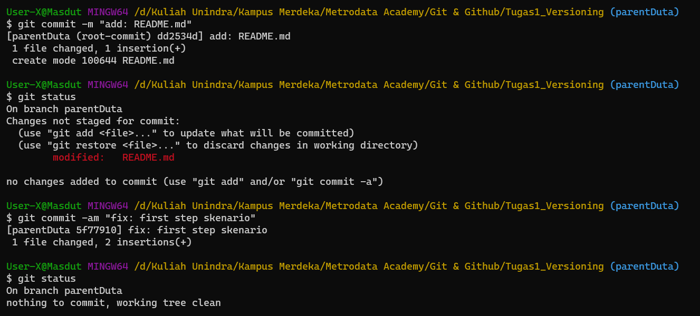
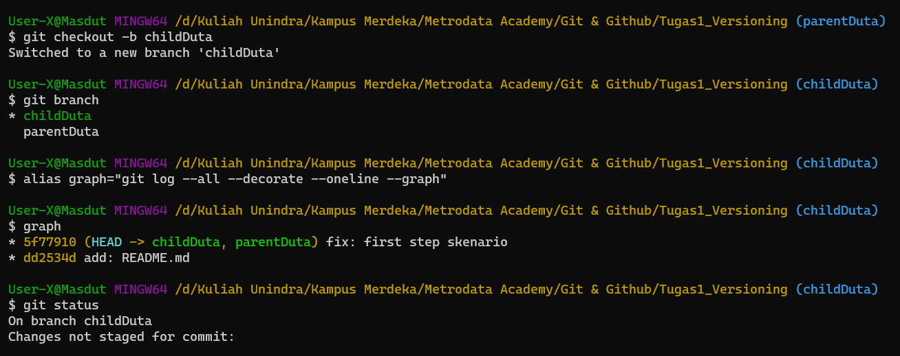
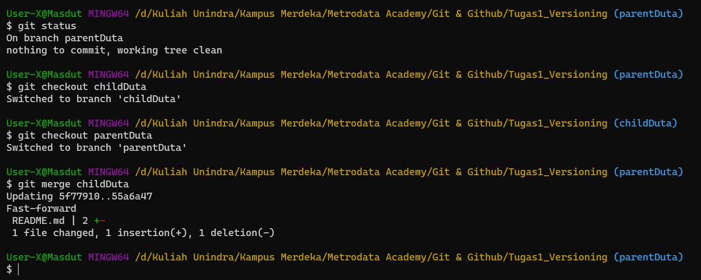

# Skenario Fast Forward

### Tahapan Skenario fast Forward 

#### Inisialisasi repository git di komputer dengan select file yang akan digunakan

#### Buat branch parent dan isikan data di dalamnya

#### Lalu buat branch child yang juga memiliki data di dalamnya

#### Fast forward akan terjadi  ketika mendapat perintah merge, antara branch child dan branch parent

