<<<<<<< HEAD
## Tugas Fakhmi Wahyu Ramdhani - Git

### Tugas Fast Forward - branch Childfakhmi

### Three Way Merge - Childfakhmi

### there Way Merge - Parentfakhmi

- git push => upload file local ke cloud
- git pull => download file cloud ke local

- reviewer => parent -> jangan sampai solved conflict
- assigness => child -> seharusnya solved conflict

- creator = write - read
- continous = read - write

## ** Laporan Tugas Git **

 ### 1. Fast Forward

- Buatlah Folder projeck
 

- Buka Git bash dan ketikkan cd "Path-project"
 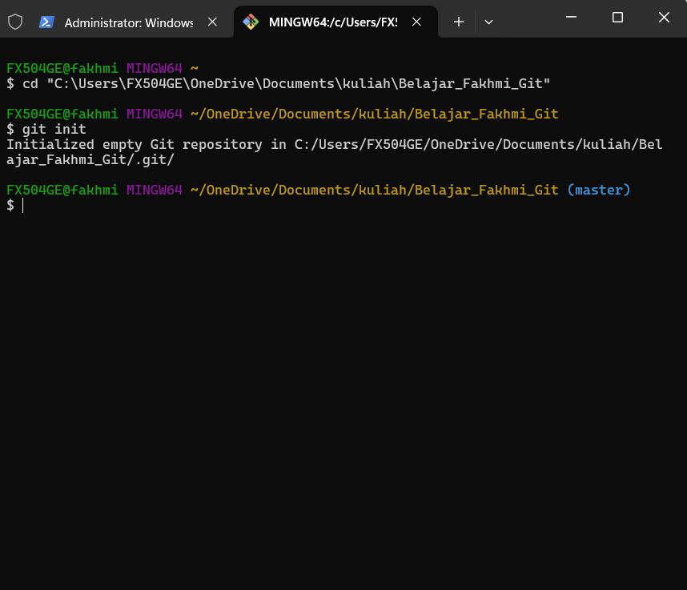

- Buatlah File README.md dan file txt (Bebas), dan Ketikkan git add . untuk mengubah status perubahan file menjadi staging area.
 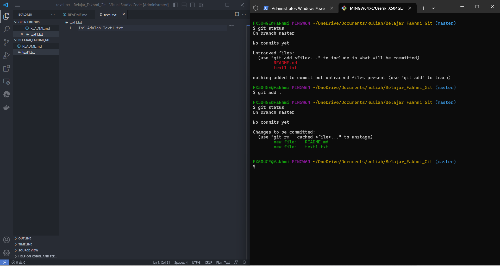

- Lalu ketikkan git commit -m "Pesan" untuk mengubah status perubahan file ke repo seperti yang ada di gambar.
 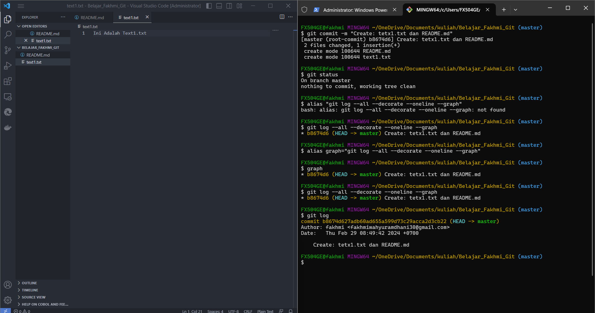

- Selanjutnya adalah untuk membuat branch baru untuk dimerge ke master branch.
 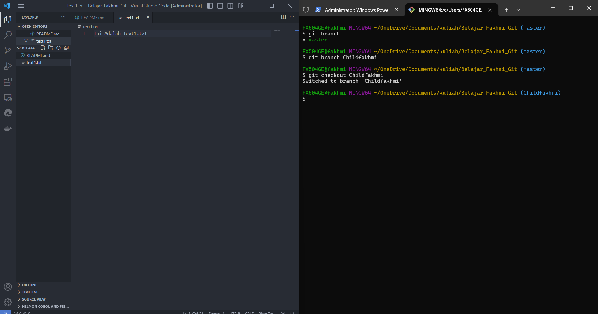

- Setelah membuat branch Childfakhmi , langkah selanjutnya masuk ke branch tersebut dengan mengetikkan perintah git checkout namabranch , kemudian buatlah file text2.txt, hal yang sama dengan melakukan git add text2.txt lalu git commit -m "pesan"
 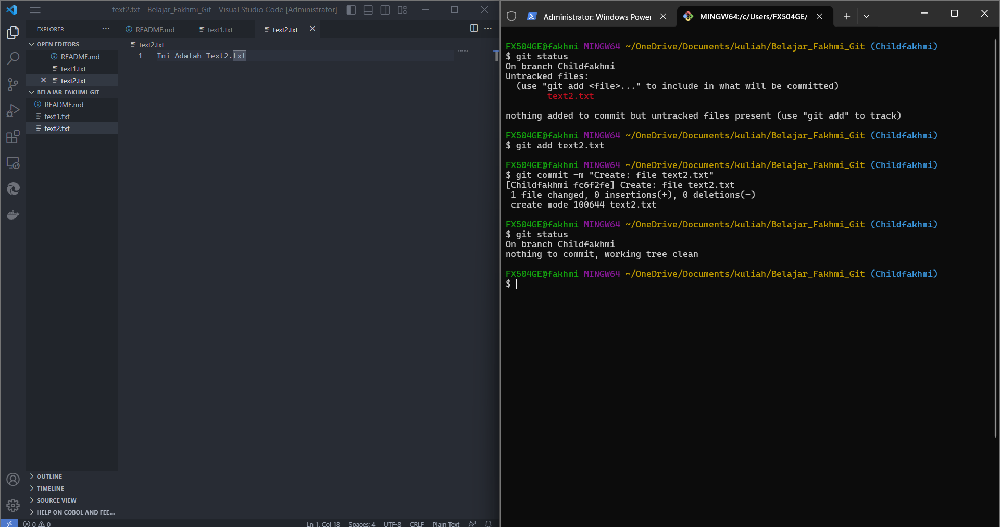

- Kemudian pergi kembali ke branch master untuk memastikan file text2.txt tidak ada , karena hanya dibuat di branch Childfakhmi
 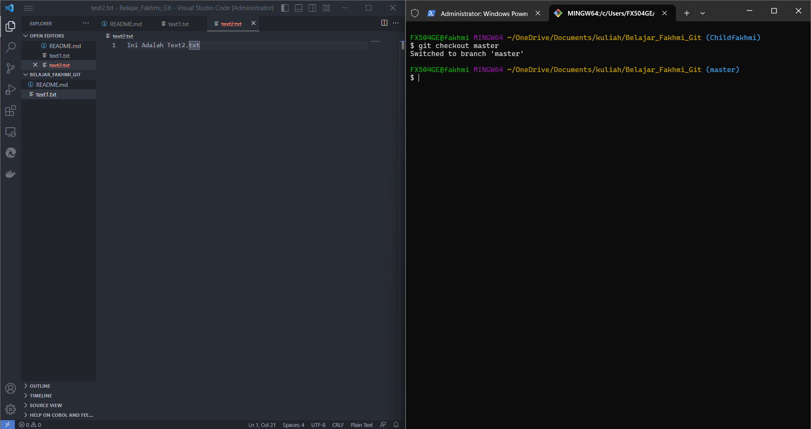

- Lakukan merge, setelah posisi kita sudah di master branch, kita ketikkan command git merge Childfakhmi
 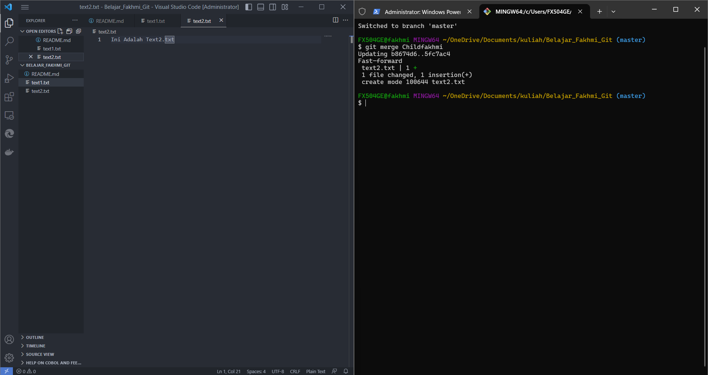

 ### 2. Push ke Repo Parent Dan Child

- saya ingin mengupdate hasil screenshoot di README.md yang di branch Parentfakhmi
)

- sekarang kita akan menyambungkan local repo kita ke server github. dengan cara ketikkan git remote add SSH, dan saya akan mengganti nama Branch master menjadi Parentfakhmi dengan mengetikkan command seperti di bawah ini.
)

- Selanjutnya adalah push pada branch Parentfakhmi dengan mengikuti langkah dibawah ini.
)

- Dan selanjutnya adalah push Chil , sama seperti step ke 4 , tetapi pindah dahulu git checkout Childfakhmi.
)

### 3. Three Way Merging

- Lakukan perubahan pada file README.MD pada Childfakhmi, agar terjadi konflik (karena sebelumnya di Parentfakhmi file tersebut sudah ada valuenya).
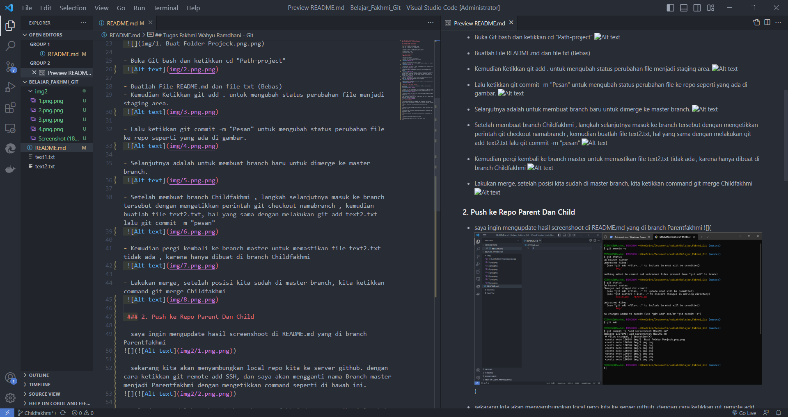

- Kemudian lakukan add dan commit pada perubahan yang terjadi.
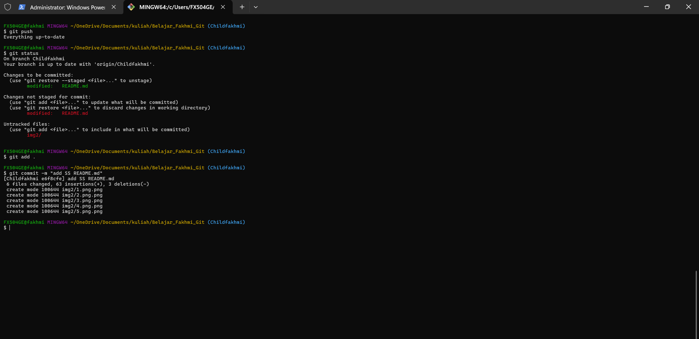

-kemudian cek graph nya dengan melihat jalurnya , apakah sudah keluar dari parent apa belum.
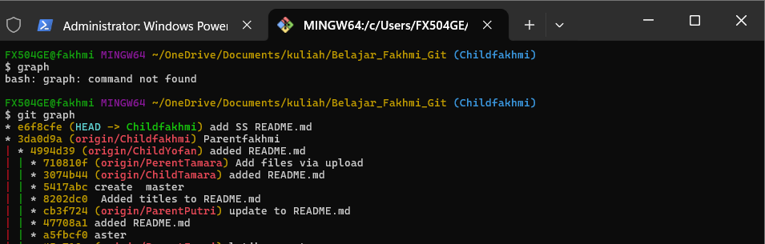

- Jika sudah maka selanjutnya adalah memperbaiki konflik menggunakan IDE VSCODE apply change.
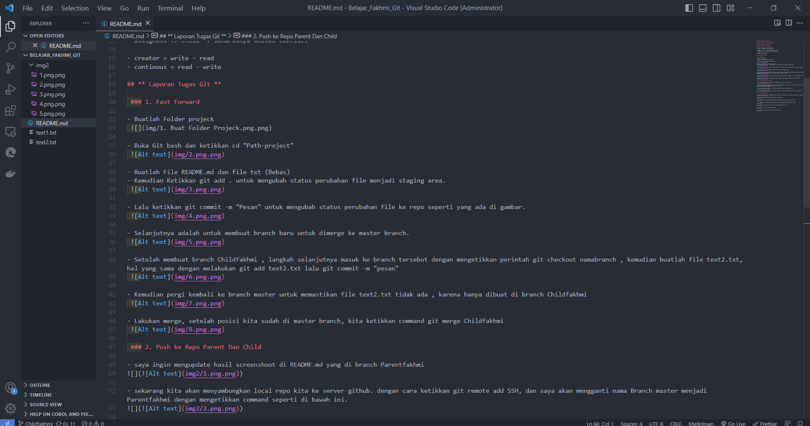

- selanjutnya akan ada commitan baru karena file telah dimodified di atas.
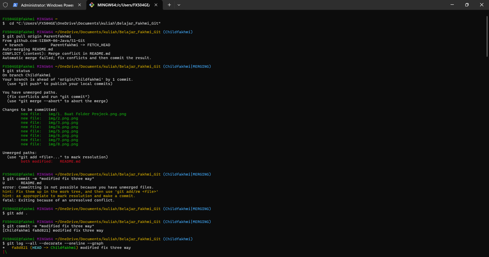

- selanjutnya lakukan pull origin Parentfakhmi
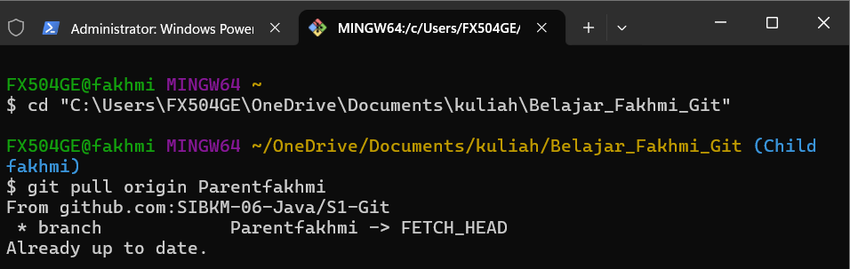

- Dan terakhir adalah git push ke repo server github.

=======
1
>>>>>>> 130769686d62f88deb30c1674f71fc1c47a31a18
