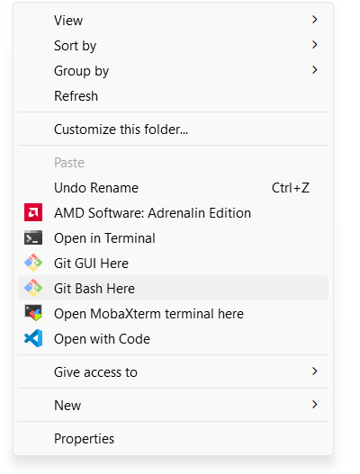
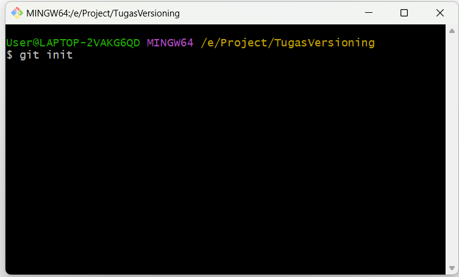
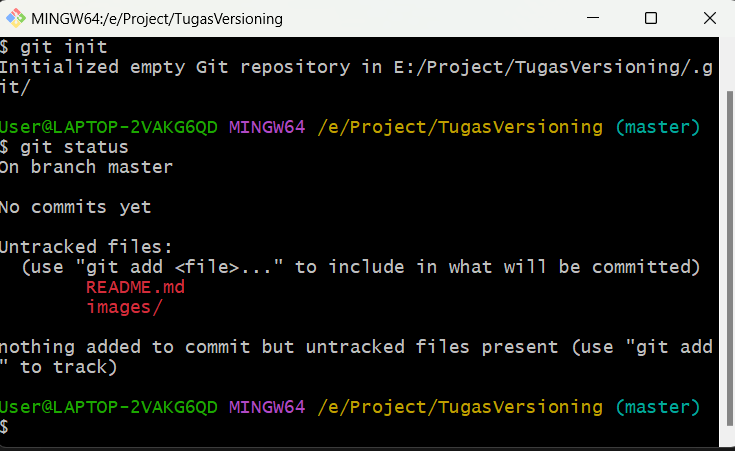
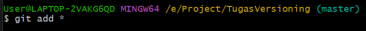
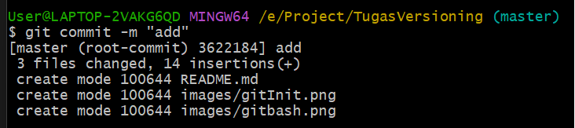
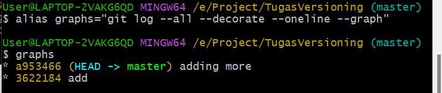
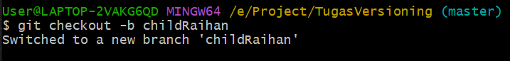

## Inisialisasi GIT
- Buatlah sebuah folder
- Klik kanan di dalam folder tersebut dan pilih git bash here
- 
- setelah gitbash terbuka ketikkan git init untuk inisialiasi
- 

## Add,Commit
- gunakan perintah git status untuk melihat adanya perubahan
- 
- "git add *" untuk menambahkan seluruh file yang ada ke dalam staging area
- 
- "git commit" untuk melakukan commit ke local repo
- 
- "git log" untuk melihat riwayat commit
- 

## Branch
- gunakan command "git checkout -b childRaihan" untuk membuat sekaligus berpindah ke branch baru
- 
- lakukan add dan commit

## merging
-
