# HALO INI SETYO ARDIKA PUTRA
## TUGAS GIT BRANCH `ChildSetyoRevisi`
# SETYO ARDIKA PUTRA
## Tugas Git

* ### Langkah 1: Disini saya membuat folder baru terlebih dahulu.

* ### Langkah 2: Selanjutnya saya membuka GitBash dan mengarahkan ke directory path folder yang sudah dibuat pada tahap sebelumya. Setelah itu menghubungkan git dengan IDE code(visual code saya dan saya sudah membuat README.md).
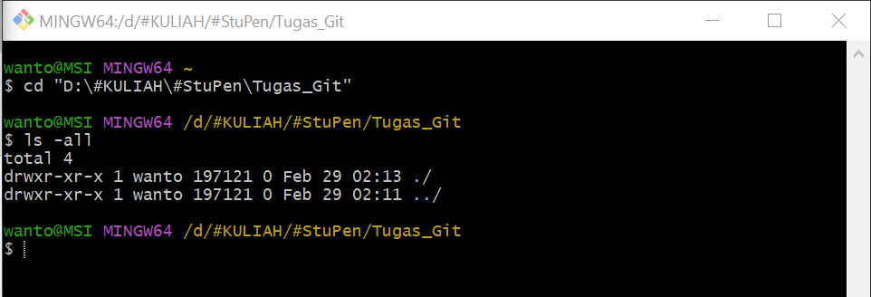
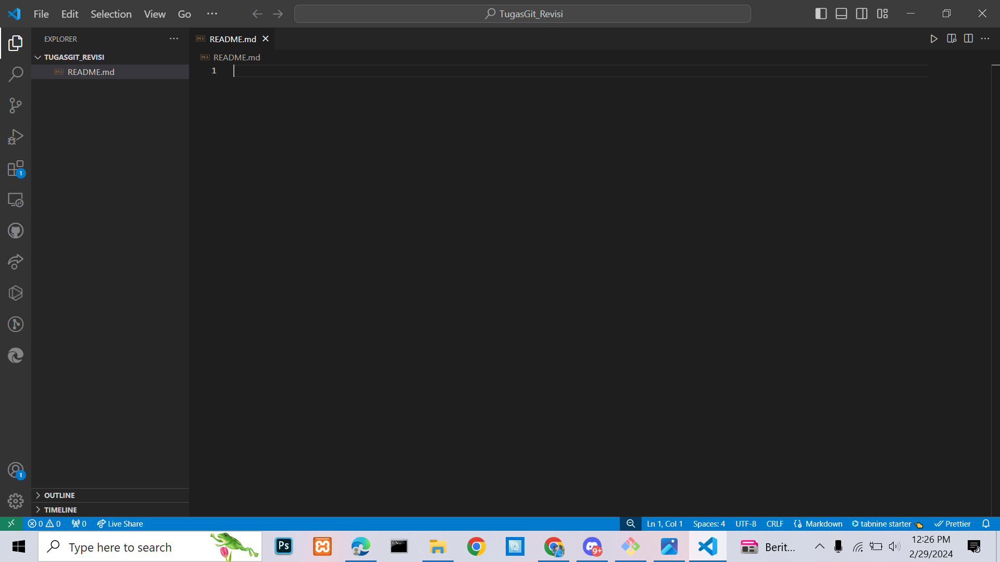

* ### Langkah 3: Selanjutnya saya melakukan `git init` dan mengecek list apa saja yang ada pada directory path.
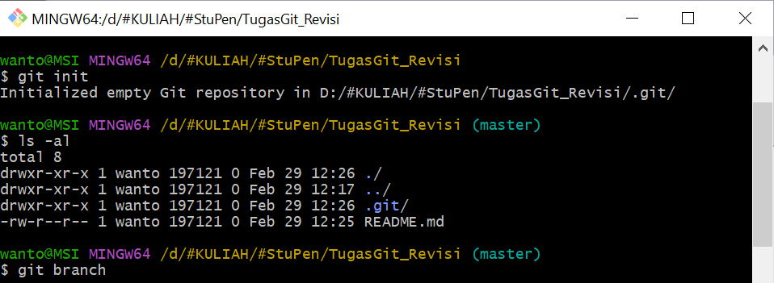

* ### Langkah 4: Selanjutnya saya disini mengecek status dari branch master. Diteruskan dengan menambahkan `README.md` ke dalam branch master.

* ### Langkah 5: Saya disini akan mengecek log dan graph pada branch master. Saya juga melakukan inisial untuk `log --all --decorate --oneline --graph` yaitu menjadi `graphs` dan mengecek branch yang tersedia.
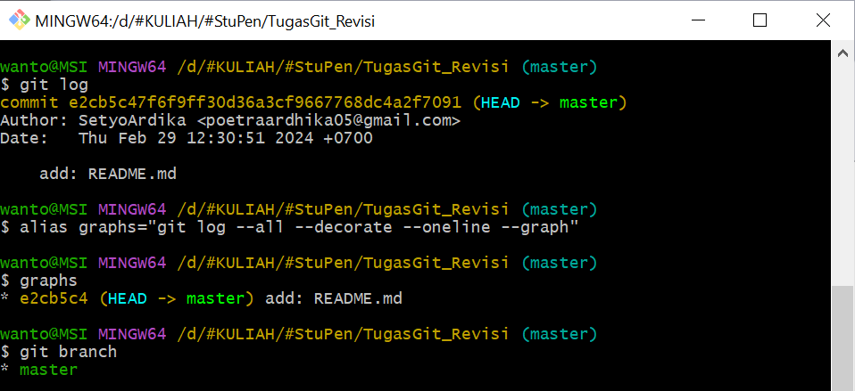

* ### Langkah 6: Disini saya mengubah nama branch `master` menjadi `ParentSetyoRevisi` dan membuat branch child yaitu `ChildSetyoRevisi`. Setelah itu update `README.md` untuk branch `ChildSetyoRevisi`.
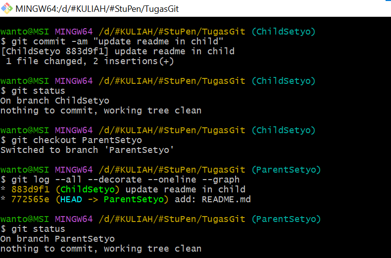
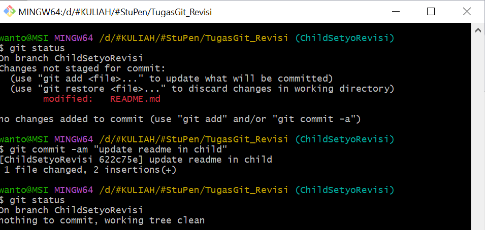
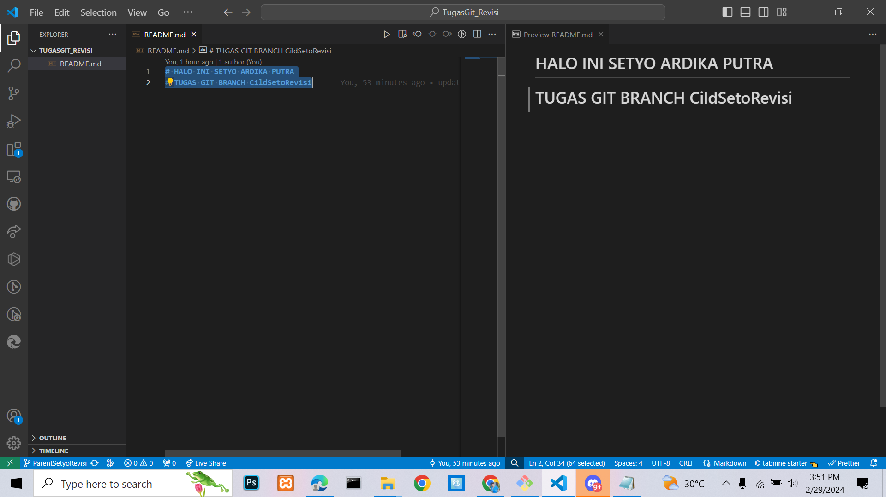

* ### Langkah 7: Mengecek graph dan status dari branch. Setelah aman semua, selanjutnya saya melakukan merge `fast-forward` kedua branch ini, antara `ParentSetyoRevisi` dengan `ChildSetyoRevisi` yang mana parent branchnya terletak pada `ParentSetyoRevisi`.
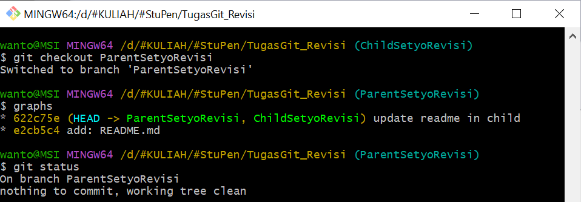
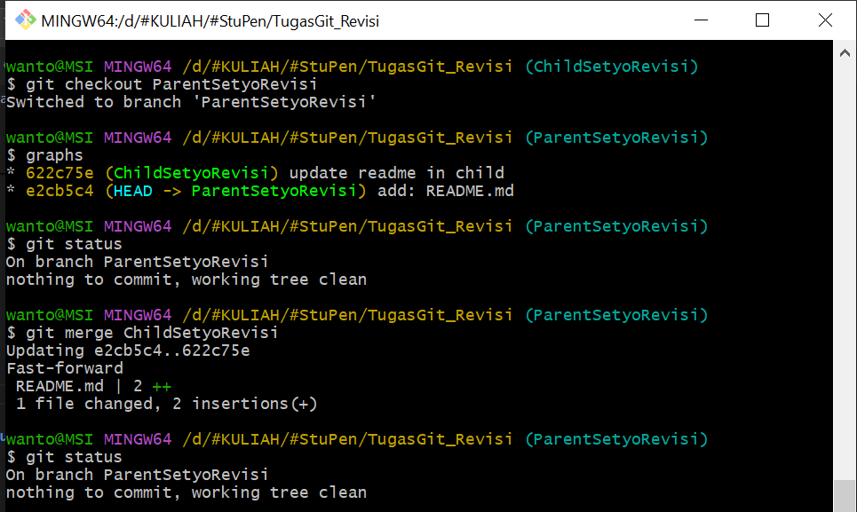

* ### Langkah 8: Menghubungkan path git dengan repository yang ada di GitHub
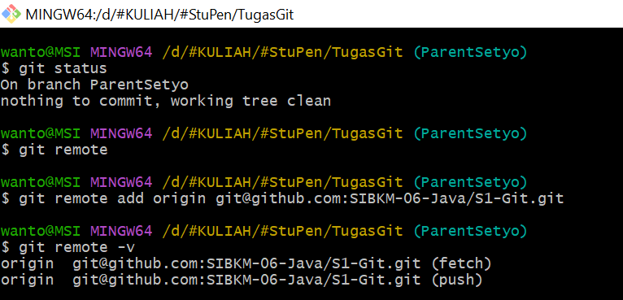

* ### Langkah 9: Melakukan push pada masing-masing branch, yaitu branch `ParentSetyoRevisi` dan `ChildSetyoRevisi`.
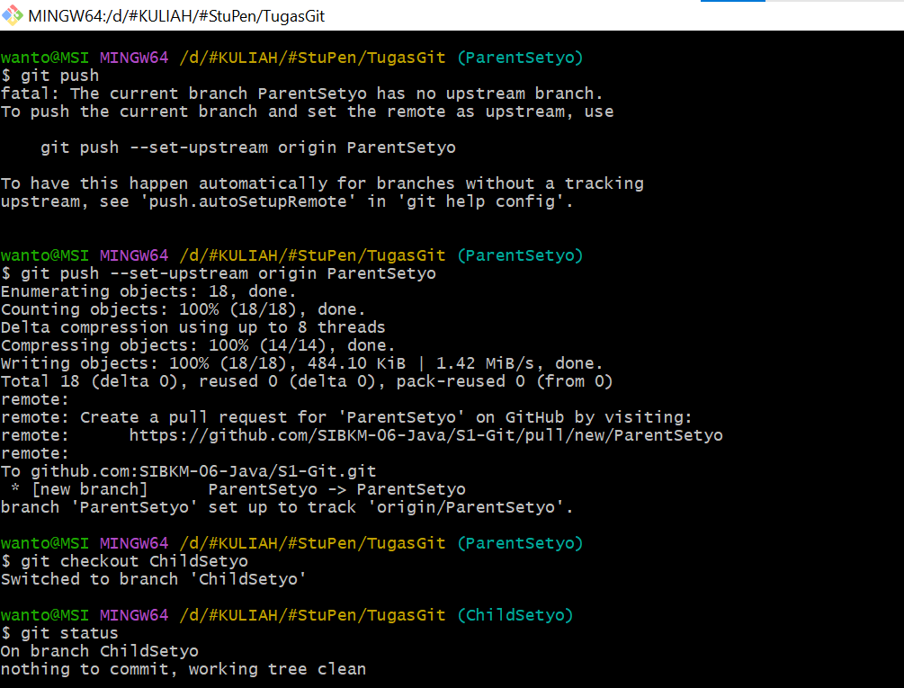
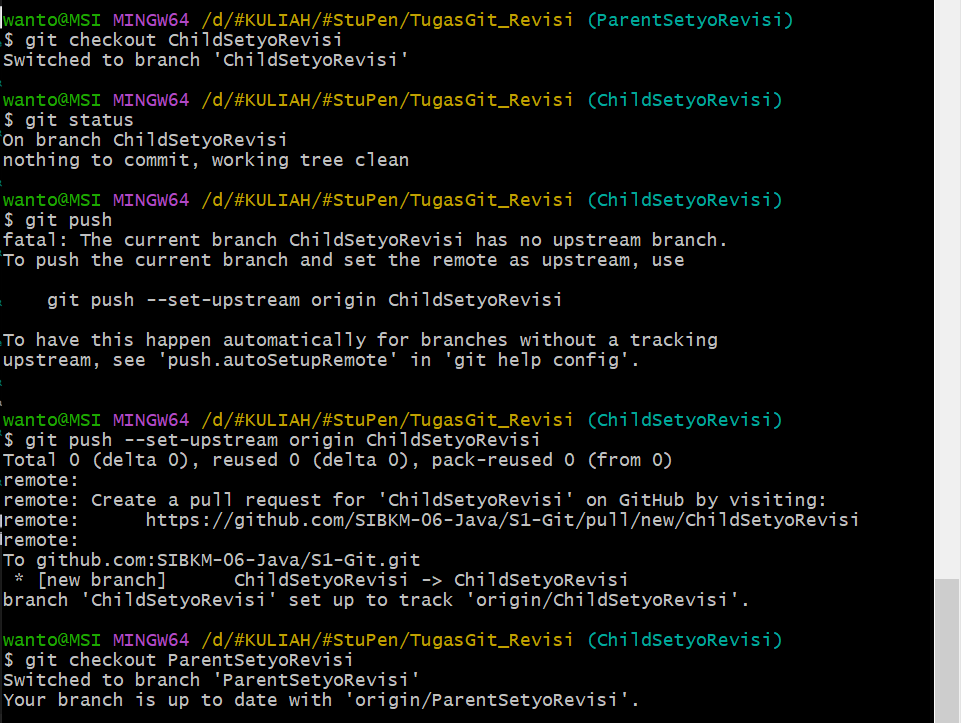

 ## Hasil screenshoot tambahan:
* ### menambahkan beberapa file gambar yang terletak di folder `img` dan `README.md` yang baru.
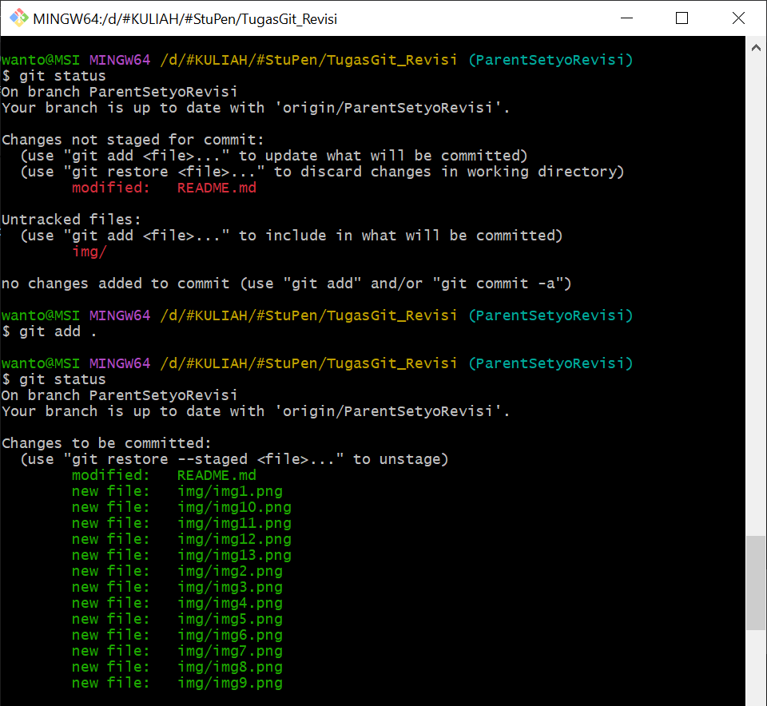
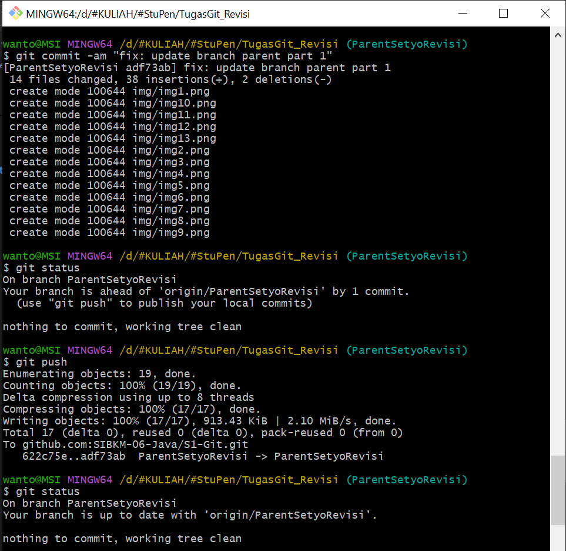

## TERIMA KASIH...