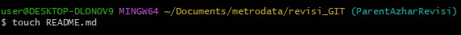
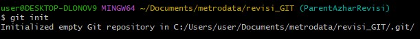
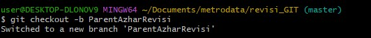
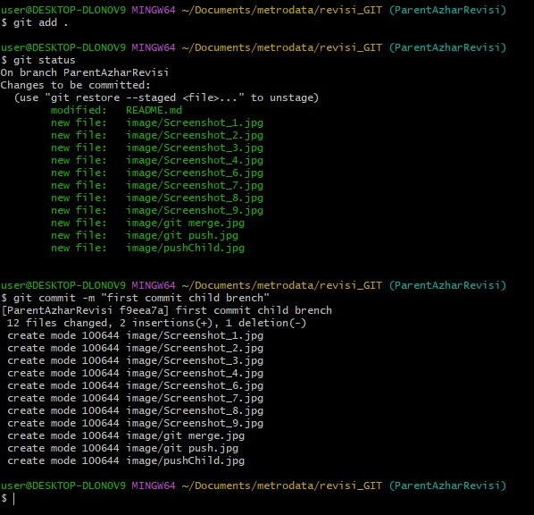
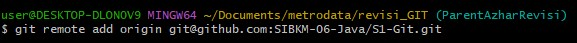
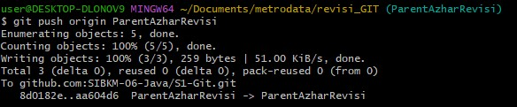
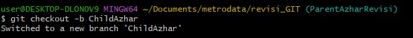
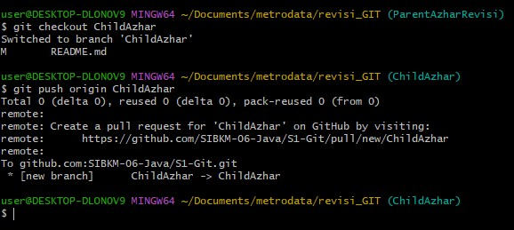

## VERSIONING 

# FAST FORWARD

1. ** Membuat file README.md **
``` bash 
touch README.md
``` 


2. ** Inisialisasi git **
``` bash
git init
```


3. ** Membuat branch dengan mengganti nama master dengan nama sesuai yang kita inginkan ***
``` bash
git checkout -b (namayangdiinginkan)
```


4. ** Push file ke Local staging area **
``` bash
git add .
git commit -m "first commit child brench"
```


5. ** Hubungkan ke Repository Github **
``` bash
git remote add origin git@github.com:SIBKM-06-Java/S1-Git.git
```


6. ** Lakukan Git Push Parent**
``` bash
git push origin ParentAzharRevisi
```


7. ** Lalu membuat Branch Child**
``` bash
git checkout -b ChildAzhar
```


8. ** Push File ke Local Staging Area **
``` bash
git add .
git commit -m "first commit child branch"
```


9. ** Lakukan Git Push Child**
``` bash
git push origin ChildAzhar
```


10. ** Lakukan Merge**
```bash
git merge  ChildAzhar
```


11. ** Lakukan Push ke repository Github **
``` bash
git push origin ParentAzharRevisi
```
