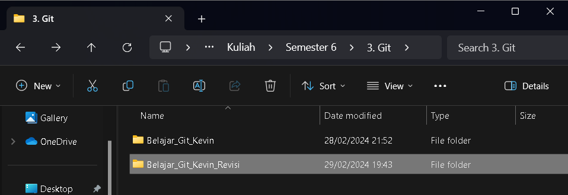
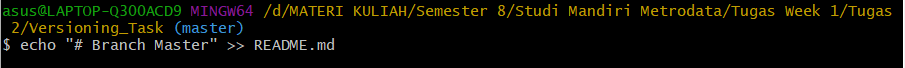
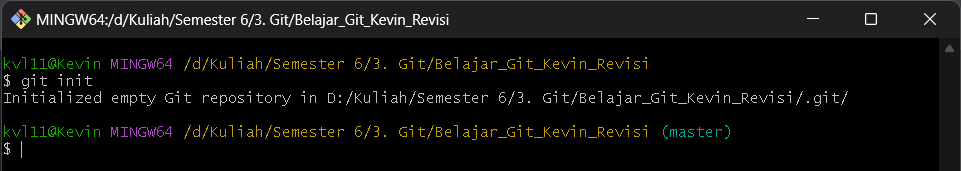
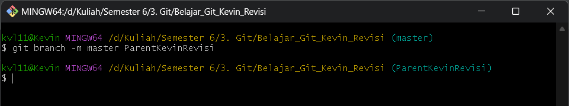
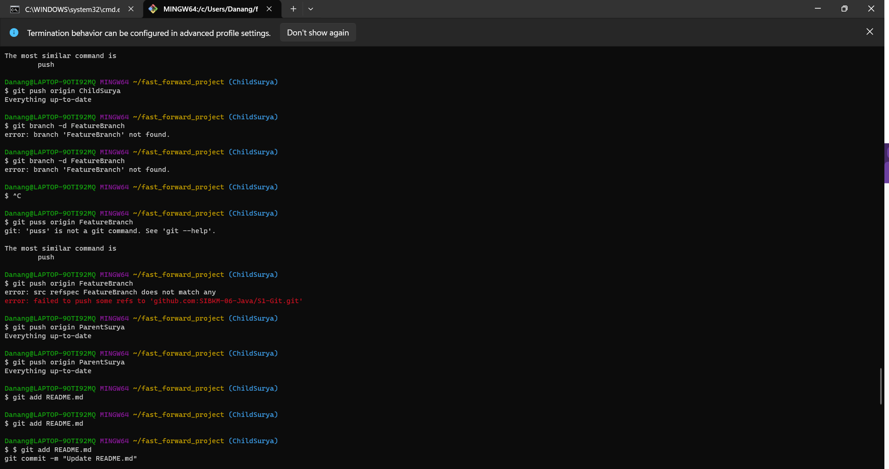
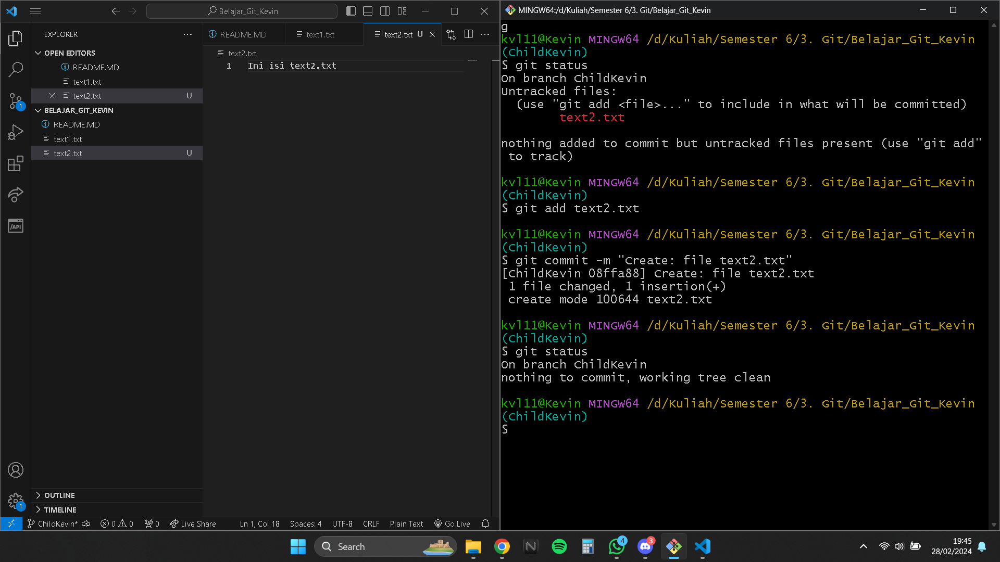
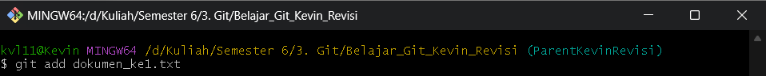

# 
Tugas 1: Versioning

## Galih Titis Bagus Catry

### Fast Forward

1. Membuat folder project dan mengetikkan perintah `git init`
   
2. Membuat parent branch dengan perintah `git checkout -b ParentGalih`, lalu memindahkan readme.md ke staging area menggunakan perintah `git add README.md`. dan commit dengan perintah `git commit -m "add readme.md"`.
   
3. Menghubungkan lokal repo ke remote repository menggunakan perintah `git remote add origin git@github.com:SIBKM-06-Java/S1-Git.git`. Setelah terhubung, maka push parent branch menggunakan perintah `git push origin ParentGalih`
   
    
   
4. Membuat branch baru dengan perintah `git checkout -b ChildGalih` dan modifikasi readme.md, kemudian ketikkan perintah `git add .` dan commit
   
5. pindahkan branch saat ini ke ParentGalih dengan perintah `git checkout ParentGalih`. setelah branch sudah di pindah, maka ketikkan perintah `git merge ChildGalih` untuk merge ke dua branch
   
6. melakukan push branch ke remote repository dengan perintah `git push origin ParentGalih`
   
7. Pindah ke branch childgalih dengan perintah `git checkout ChildGalih` dan push menggunakan perintah `git push origin ChildGalih`
   
   
