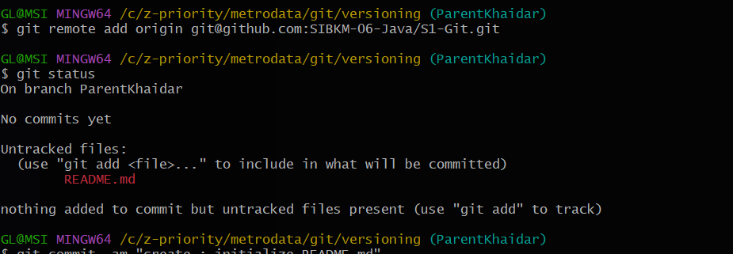
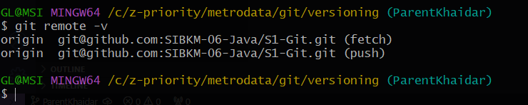
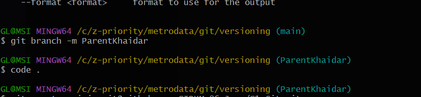
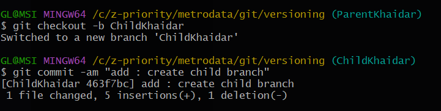
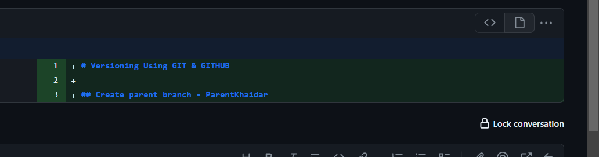
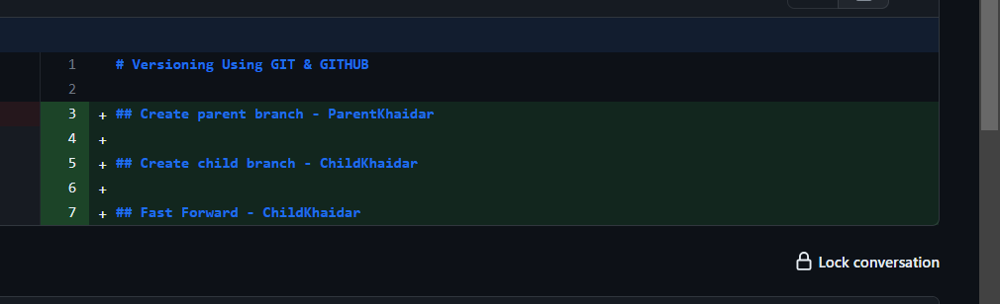
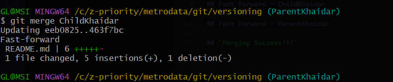

# Versioning Using GIT & GITHUB

## - Add remote from github accout - ParentKhaidar

## - Create parent branch - ParentKhaidar

## - Create child branch - ChildKhaidar

## - Fast Forward - ChildKhaidar

## - Fast Forward - ParentKhaidar

## - Clone github repository - ChildKhaidar

## - Switch branch matching in repository - ChildKhaidar

## - Three Ways Merging

## `Merging Success!!!`

# **Laporan**

* Remote github account /n

* Check remote in local

* Create parent branch

* Create child branch

* Parent before merging (fast forward)

* Parent after merging

* Fast forward result

