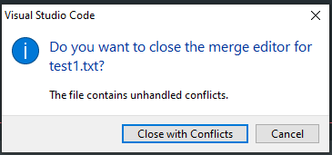

# Laporan Tugas Git - Maulana Dzikri H

##

## **--- FAST FORWARD MERGE ---**

---

### - Membuat folder project

buat%20folder%20project.png>)

### - Membuka git bash di folder project

%20buka%20git%20bash%20di%20folder%20project.png>)

### - Menginisialisasi project

%20inisialisasi%20project.png>)

### - Menghubungkan repo local dengan repo github

%20menghubungkan%20repo%20local%20ke%20server%20github.png>)

### - Membuat file readme dan test1

%20membuat%20file%20readme%20dan%20test1.png>)

### - git add . perubahan file

%20git%20add.png>)

### - git commit

%20git%20commit.png>)

### - Mengubah nama branch master menjadi ParentDzikri

%20mengubah%20nama%20branch%20master.png>)

### - push branch ParentDzikri ke repo github

%20git%20push.png>)

### - Cek commit

%20cek%20commit.png>)

### - Membuat branch baru dengan nama ChildDzikri dan pindah ke branch tersebut

%20buat%20branch%20child.png>)

### - Menambahkan kalimat pada line 3 di text1.txt (saya lupa untuk ss add dan commitnya)

%20tambah%20line%20di%20child.png>)

### - Cek commit (saya pindah ke terminal git bash di dalam vs code)

%20cek%20commit2.png>)

### - Push branch ChildDzikri ke repo github

%20push%20commit2.png>)

### - Commit tambah foto

### - Pindah ke branch ParentDzikri lalu merge branch ChildDzikri

### - Branch ParentDzikri dan ChildDzikri sudah ter-merge

---

## **--- THREE WAY MERGE ---**

### - Clone project repository S1-Git di luar folder project lain

### - Masuk ke folder project

### - Membuat perubahan pada branch Child

Pindah terlebih dahulu ke branch ChildDzikri caranya dengan perintah `git checkout ChilDzikri`. Setelah itu membuat perubahan pada file1.txt dan langsung commit `git commit -am "message"`.

### - Membuat perubahan pada branch Parent

Pindah terlebih dahulu ke branch ParentDzikri caranya dengan perintah `git checkout ParentDzikri`. Setelah itu membuat perubahan pada file1.txt dan langsung commit `git commit -am "message"`

### - Cek Commit

### - Push branch Parent

### - Push branch Child

### - Pull branch Parent di branch Child

Pilih 'Access Both Changes'

### - Resolve in merge editor

### - Complete Merge

#### complete with conflicts

#### Close With Conflicts

### - git status. Conflict Solved

permintaan commit untuk merge

### - git commit

### - cek status setelah commit

diminta untuk push local commits

### - git push local commits

### - Lihat pada repo github, branch ChildDzikri sudah ter-merge dengan ParentDzikri

### - Masuk ke Pull Request untuk merge branch ChildDzikri ke ParentDzikri

### - Membuat Pull Request baru

### - Pilih branch ParentDzikri sebagai base, lalu pilih branch ChildDzikri sebagai compare branch. lalu klik Create Pull Request

### - Masukan title PR, lalu pilih Reviewers yaitu ka fuad. dan pilih Assigneesnya saya sendiri. Kemudian klik Create Pull Request

### - Pull Request berhasil dibuat. Scroll ke bawah untuk merge PR

### - Klik Merge pull request

### - Confirm merge

### - Pull Request berhasil di merge

### - Branch ParentDzikri pada repo github berhasil di merge

### - Branch ChildDzikri sudah berhasil dimerge pada local repo

### - Cek branch local ParentDzikri. ternyata belum termerge

### - Mengupdate local branch ParentDzikri dengan yang ada di repo github menggunakan perintah `git pull origin ParentDzikri`

# SEKIAN TERIMA KASIH :)
