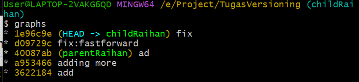
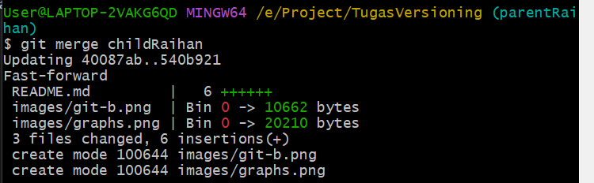
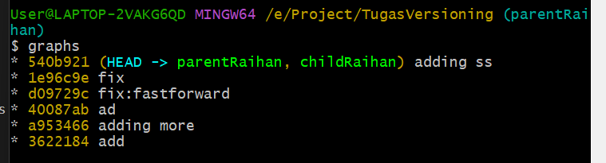
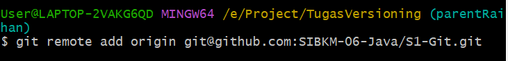
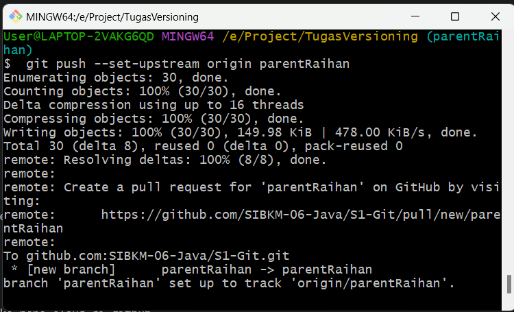
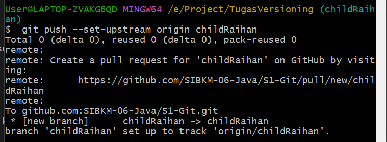

## Inisialisasi GIT
- Buatlah sebuah folder
- Klik kanan di dalam folder tersebut dan pilih git bash here
- 
- setelah gitbash terbuka ketikkan git init untuk inisialiasi
- 

## Add,Commit
- gunakan perintah git status untuk melihat adanya perubahan
- 
- "git add *" untuk menambahkan seluruh file yang ada ke dalam staging area
- 
- "git commit" untuk melakukan commit ke local repo
- 
- "git log" untuk melihat riwayat commit
- 

## Branch
- gunakan command "git checkout -b childRaihan" untuk membuat sekaligus berpindah ke branch baru
- 
- lakukan add dan commit seperti biasa
- bisa dilihat pada gambar dibawah hanya childParent saja yang berubah.
- 

## merging
- Sebelum melakukan merging pindahkan dulu ke branch parent nya
- gunakan command "git merge child" untuk melakukan merge dari parent ke child
- 
- diliat dari graphs posisi parent dan child sudah sejajar
- 

## Remote
- perintah pada gambar dibawah ini untuk menghubungkan repo lokal kita ke repo cloud di github
- 
- Kemudian kita akan melakukan push dari branch parent ke repo github
- 
- Lakukan juga kepada branch child
- 
