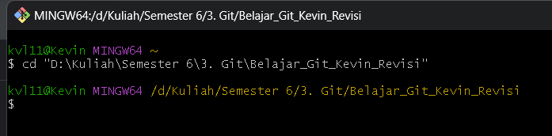
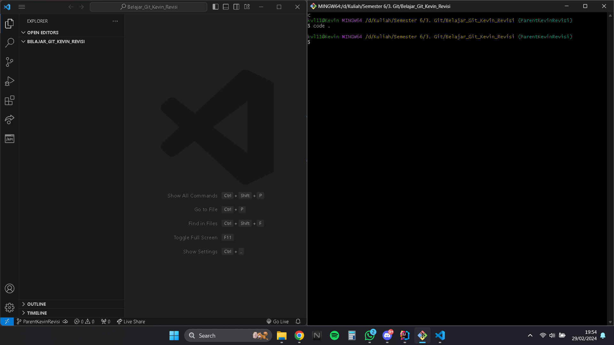
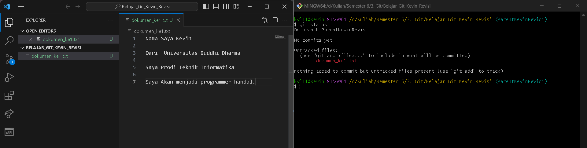
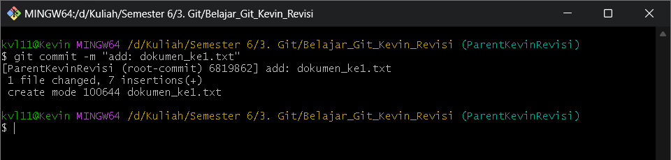
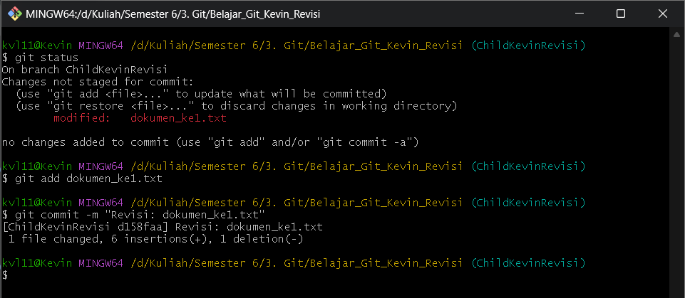
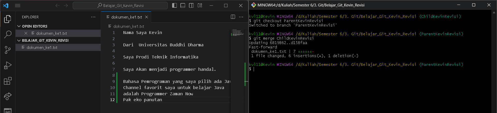
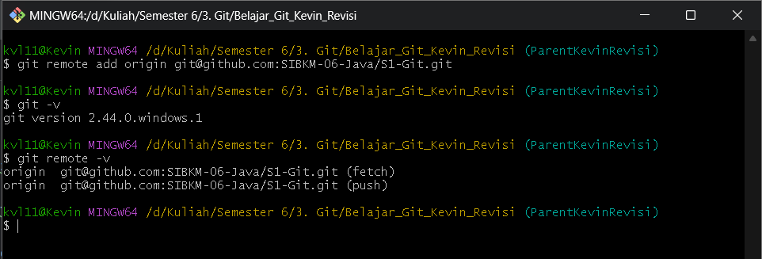
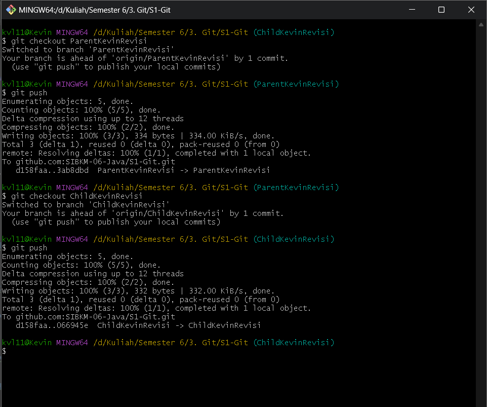

## Kevin

# FAST FORWARD

#### Berikut Langkah-langkahnya

- Buatlah Folder Project Git
  
- Buka GitBash
- Masuk ke folder letak Project dibuat dengan mengetikkan command seperti dibawah ini.
```
cd "D:\Kuliah\Semester 6\3. Git\Belajar_Git_Kevin_Revisi"
```
  
- Ketikkan perintah ``git init`` membuat repository yang ada pada file lokal dan berlokasi di folder .git.
  
- Ubah Nama Branch Master Menjadi ParentKevinRevisi dengan mengetikkan ``git branch -m master ParentKevinRevisi``
  
- Buka IDE Visual Studio Code dengan mengetikkan command ``code .``
  
- Langkah selanjutnya adalah membuat file dummy (bebas).
- Setelah membuat file dummy coba cek status dengan mengetikkan ``git status``
  
- Masukkan `dokumen_ke1.txt` ke staging index dengan mengetikkan ``git add dokumen_ke1.txt``
  
- Kemudian setelah dipindahkan ke staging index masukkan ke repository dengan mengetikkan ``git commit -m "add: dokumen_ke1.txt"``
  
- Sekarang kita akan membuat branch ChildKevinRevisi , ketikkan command ``git branch ChildKevinRevisi`` , untuk memastikan apakah branch telah dibuat kita bisa mengetikkan command ``git branch``
  
- Masuk ke branch Childnya dengan mengetikkan ``git checkout ChildKevinRevisi`` , kemudian tambah isi dari file `dokumen_ke1.txt`
  
- Lakukan step untuk memasukkan perubahan tersebut ke staging area dan repository seperti langkah sebelumnya.
  
- Ketikkan ``git log --oneline`` untuk melihat log
  
- Langkah selanjutnya adalah melakukan `merge` branch `ParentKevinRevisi` dengan `ChildKevinRevisi`
- Kita pindah ke posisi branch `ParentKevinRevisi` dengan mengetikkan ``git checkout ParentKevinRevisi`` kemudian ketikkan ```git merge ChildKevinRevisi```
  

### FAST FORWARD SUDAH SELESAI
### LANGKAH SELANJUTNYA ADALAH MELAKUKAN PUSH KE CLOUD REPOSITORY

### Berikut Langkah-langkahnya
- Ketikkan ``git remote add origin git@github.com:SIBKM-06-Java/S1-Git.git`` untuk menghubungkan local repository kita ke cloud repository. Jika sudah pastikan berhasil terhubung dengan mengetikkan command `git remote -v` seperti gambar dibawa ini
  
- Lakukan push terhadap 2 branch yaitu `ParentKevinRevisi` dan `ChildKevinRevisi` dengan mengetikkan command ``git push``.
  
  
- Langkah selanjutnya cek di cloud repository apakah sudah berhasil terupload, jika berhasil akan seperti gambar dibawah ini.
  

# THREE WAY MERGING
Kita akan melakukan THREE WAY MERGING , tetapi sebelumnya kita akan melakukan cloning dari cloud repo ke local repo kita.

- Langkah pertama adalah buka Git bash
- Pergi menuju folder / lokasi yang akan anda letakkan hasil cloning.
  
- Di gitbash masuk ke path folder tersebut lalu ketikkan command ini ``git clone git@github.com:SIBKM-06-Java/S1-Git.git``, maka akan ada folder `S1-Git` yang terbuat. 
  
- Kemudian masuk ke folder S1-Git tersebut dari gitbash
- Masuk ke branch `ParentKevinRevisi` kemudian buka IDE VScode. seperti contoh dibawah ini.
  
- Tambahkan sesuatu difile dummy dokumen_ke1.txt untuk mempraktekkan THREE WAY MERGING pada masing-masing branch yaitu `ParentKevinRevisi` dan `ChildKevinRevisi`
  
  
- Lakukan push 2 branch tersebut ke cloud repo
  
- Cek apakah sudah terupload ke cloud repo
  
  
- Sekarang kita akan melakukan merge , tetapi dengan PR (Pull Request).
- Langkah selanjutnya kita akan melakukan pull untuk mengecek / solve konflik.
- Posisi ke Branch `ChildKevinRevisi` lalu lakukan pull ke `ParentKevinRevisi` dengan mengetikkan command ``git pull origin ParentKevinRevisi``
  
- Dari foto di atas bisa dilihat sebelah kanan akan terlihat pilihan untuk melakukan solve conflict, pilih `Accept Both Change`.
  
- Karena ada perubahan data terhadap file tersebut , maka `dokumen_ke1.txt` kita perlu melakukan commit untuk memasukkan kembali ke repository
  
- Selanjutnya kita akan push `ChildKevinRevisi` ke cloud repo.
  
  
- Langkah selanjutnya adalah melakukan PullRequest di cloud repo
- Klik Compare & pull request pada `ParentKevinRevisi`
  
- Pilih Base Branch nya `ParentKevinRevisi` dan compare `ChildKevinRevisi` dan Masukkan reviewer nya Pak fuad , dan assigness nya diri kita, Masukkan judul juga ya
  
- Klik Create pull Request
- Kemudian Kita Merge pull request sendiri :v
  
- Maka data `ParentKevinRevisi` akan sama seperti `ChildKevinRevisi`
  
- Langkah selanjutnya adalah kita mengupdate data `ParentKevinRevisi` yang ada dilocal repo dengan cara pull ke cloud repo
- Ketikkan command ``git pull origin ParentKevinRevisi``
  


