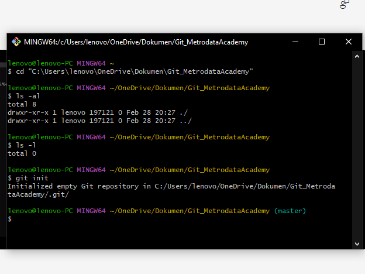
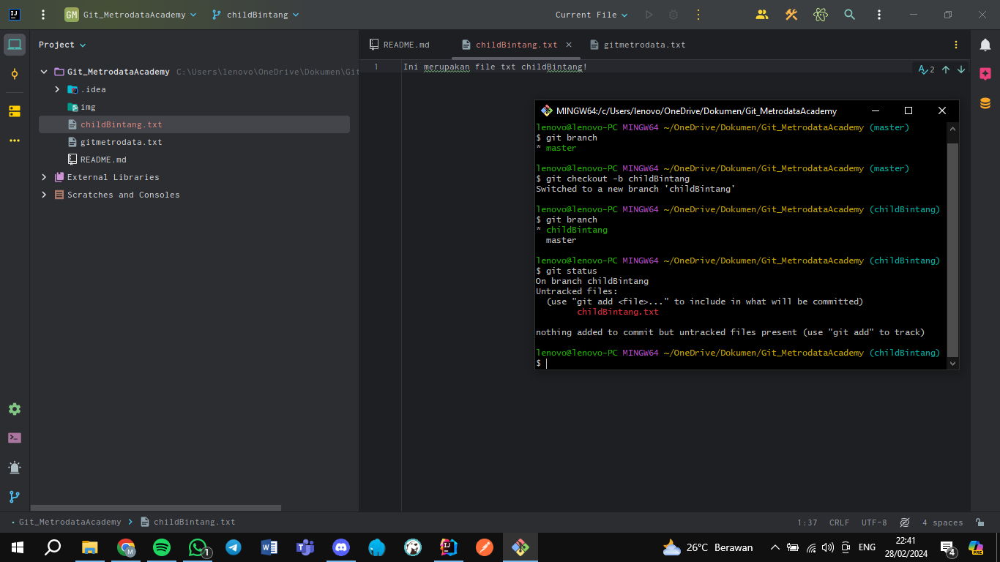

## Muhamad Bintang Alfarizki

## Fast Forward Merge
#
#### Langkah 1
Membuat sebuah folder baru

#### Langkah 2
Buka Git Bash, lalu ketik direct foldernya, git init

#### Langkah 3
Buatlah file, contohnya README.md dan file txt

#### Langkah 4
1. Git add * (* atau .) untuk menambahkan file ke dalam staging area
2. Git status untuk mengetahui status repo kita 
3. Git commit untuk mengcommit dan kita bisa menambahkan message

#### Langkah 5
Menampilkan Log dan Graph

#### Langkah 6
1. Membuat branch baru (child branch) yang nantinya di-merge ke parent branch
2. Menambahkan 1 buah file txt, lalu add, cek status, commit

#### Langkah 7
Kembali ke branch master, memastikan tidak adanya file baru yang terbawa ke master

#### Langkah 8
Setelah berada di master, lakukan merge dengan command git merge childBintang

## Three Way Merge
#
#### Langkah 1
Push child branch ke repository.

#### Langkah 2
Setelah di-push ke github repository, kita membuka salah satu file yang sama di branch parent dan child untuk melakukan perubahan agar terjadi konflik.

#### Langkah 3
Menuju ke branch child untuk melakukan git pull terhadap branch parent menggunakan git pull ParentBintang.

#### Langkah 4
Terjadi konflik antara branch parent dan branch child ketika git pull. Lalu kita bisa menggabungkan perbedaan pada kedua branch tersebut dengan Accept Both Changes.

#### Langkah 5
Setelah selesai, maka kita diminta untuk mem-push perubahan yang ada karena adanya perubahan.
