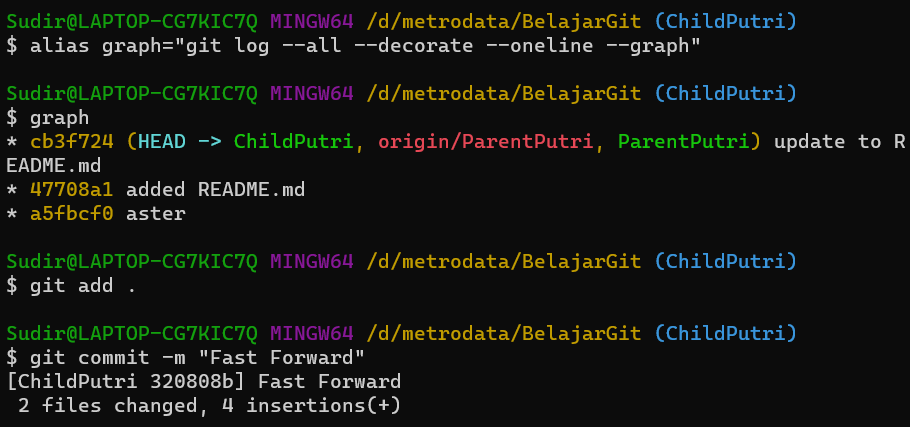
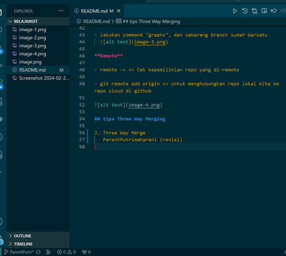
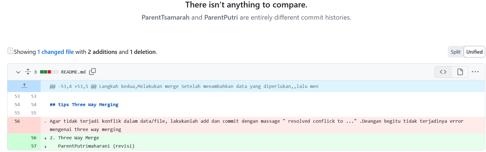

## hi Putri Maharani

i hope u hard study and are great !!

## Laporan TUGAS_Versioning

Langkah pertama, Tentukan lokasi project yang akan dibuat dengan "cd". selanjutnya

git init => untuk menginisialisasi repo git di komputer kita

git remote -v => mengecek kepemilikian repo yang di-remote

git status =>untuk mengetahui status repo kita

git commit => untuk melakukan commit

git add . => menambahkan file baru ke repository yang baru dipilih

## Fast Forward

Langkah kedua,Melakukan merge Setelah menambahkan data yang diperlukan,,lalu mengganti branch dengan [git checkout (parent branch)] lalu melakukan merge dengan cara [git merge (child branch)]

**Branch**

- Lakukan command "git checkout -b "childPutri" untuk membuat sekaligus berpindah ke branch baru

- lakukan [git add . ] dan commit seperti biasa

* bisa di cek bahwa,hanya branch(ChildPutri) saja yang berubah
  

**Merging**

- kita perlu melakukan merging,tetapi pindahkan ke branch utama(ParentPutri)
- command git merge ChildPutri

  

- lakukan command "graphs", dan sekarang branch sudah bersatu
  

**Remote**

- remote -v => Cek kepemilikian repo yang di-remote

- git remote add origin => untuk menghubungkan repo lokal kita ke repo cloud di github

## Three Way Merge

- clone dari github(cloud) ke local repo
  > git clone git@github.com:SIBKM-06-Java/S1-Git.git

> cd S1-Git

> masuk ke branch ParentPutri n ChildPutri
> 

- selanjutnya, Edit file readme.md di branch parent agar nantinya akan terjadi conflict dengan branch child
  
- Lakukan commit dan push pada branch parent
  
- lakukan dengan hal sama pada branch ChildPutri, tetapi tidak dipush
  
- Lakukan git pull dari branch child ke branch parent
  
- setelah itu, Terjadi Solve conflict dengan file README.md
  
- Lakukan commit dan pull seperti gambar dibawah ini
  

## PR (Pull Request)

- Buka pull request dan lakukan open new pull request dengan branch parent sebagai base dan child parent sebagai subjek yang ingin dikomparasi
  
  

      

  

- Untuk Accept Merge perlu diketahui ini tidak dilakukan sendiri tanpa persetujuan reviewer namun dalam kasus ini hanyalah uji coba saja)

  
