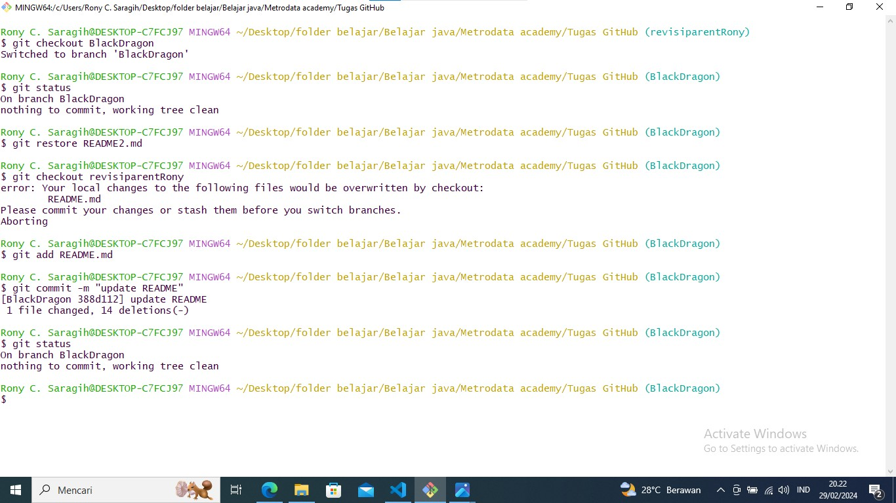

# Melakukan Fast Forward
 
<<<<<<< HEAD
Hallo nama saya Rony
=======
 ## 1. `Melakukan git init`

    

 ##  2. ` Masuk ke branch revisiParentRony,lalu membuat perubahan dan akan melakukan commit` 

    
    
    
    
    

 ## 3. `Masuk ke branch BlackDragon, lalu membuat perubahan dan akan melkukan commit `

    

 ## 4. `ketika adanya kesalahan pada penggabungan sehingga harus diundur`

    

 ## 5. `Push File yang sudah di commit sebelum pengabungan branch`
   
    

 ## 6. `Melakukan merge kepada revisiParent dan berhasil`

    
    

     

# Melakukan Three Way Merge

 ## 7. Pull Request
    
    

 ## 8. git clone
   
   ! 

>>>>>>> revisiparentRony

