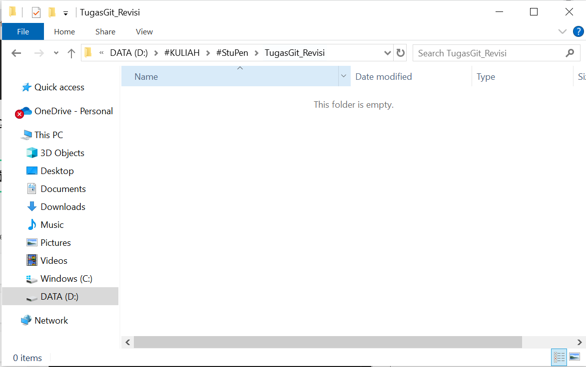
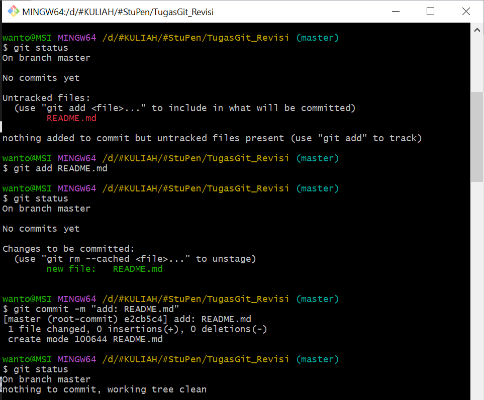

# SETYO ARDIKA PUTRA
## Tugas Git

### Langkah 1: Disini saya membuat folder baru terlebih dahulu.

### Langkah 2: Selanjutnya saya membuka GitBash dan mengarahkan ke directory path folder yang sudah dibuat pada tahap sebelumya. Setelah itu menghubungkan git dengan IDE code(visual code saya dan sasya sudah membuat README.md) dan "git init".

### Langkah 3: Selanjutnya saya ingin 'git add' README.md ke branch master(ParentSetyo) tetapi beberapa percobaan gagal.

### Langkah 4: Selanjutnya saya disini mengecek status dari branch master. Diteruskan dengan merubah nama branch 'master' menjadi 'ParentSetyo'. Dan saya membuat brand child yaitu ChildSetyo.

### Langkah 5: Saya disini akan 'git add' atau menambahkan README.md ke branch ChildSetyo. Lalu switch ke ParentSetyo lagi dengan 'git checkout ParentSetyo'

### Langkah 6: Disini saya merge antara ParentSetyo dengan ChildSetyo menggunakan fast -forward dan hasilnya berhasil

### Langkah 7: Selanjutnya saya ingin update kondisi pada path ini di branch ParentSetyo. Saya menambahkan folder img beserta beberapa gambar didalamnya, dan juga saya merubah isi yang ada pada README.md

### Langkah 8: Menghubungkan path git dengan repository yang ada di GitHub

## Langkah 9: Melakukan push pada masing-masing branch, yaitu branch ParentSetyo dan ChildSetyo

