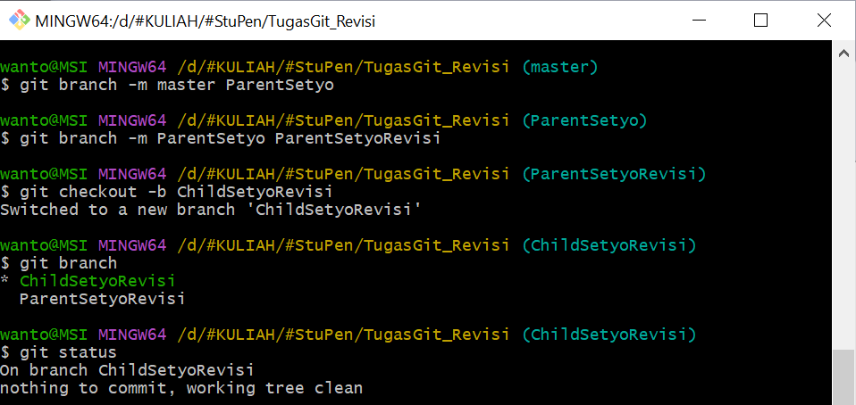
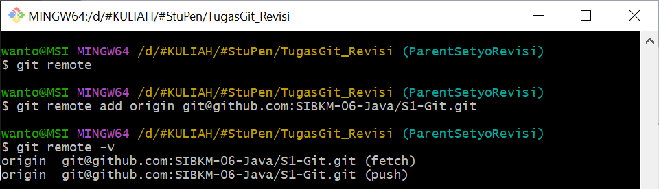
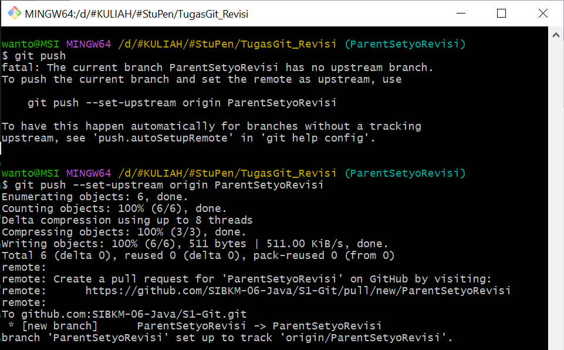
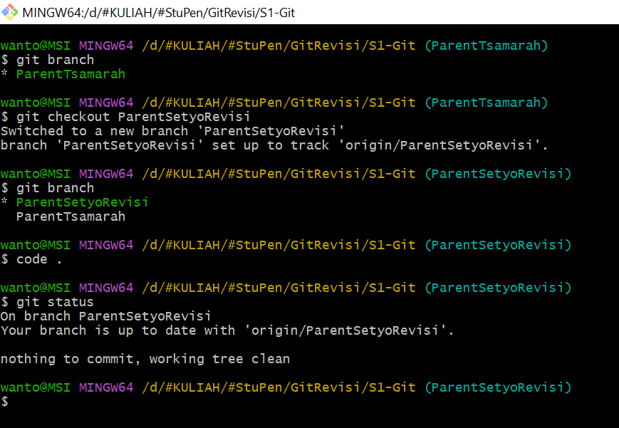
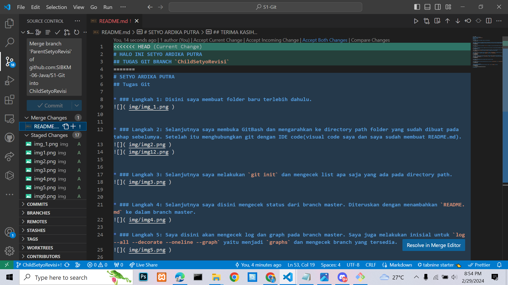

# HALO INI SETYO ARDIKA PUTRA
## TUGAS GIT BRANCH `ChildSetyoRevisi`
# SETYO ARDIKA PUTRA
## Tugas Git

## 1. FAST-FORWARD Merge

* ### Langkah 1: Disini saya membuat folder baru terlebih dahulu.

* ### Langkah 2: Selanjutnya saya membuka GitBash dan mengarahkan ke directory path folder yang sudah dibuat pada tahap sebelumya. Setelah itu menghubungkan git dengan IDE code(visual code saya dan saya sudah membuat README.md).

* ### Langkah 3: Selanjutnya saya melakukan `git init` dan mengecek list apa saja yang ada pada directory path.

* ### Langkah 4: Selanjutnya saya disini mengecek status dari branch master. Diteruskan dengan menambahkan `README.md` ke dalam branch master.

* ### Langkah 5: Saya disini akan mengecek log dan graph pada branch master. Saya juga melakukan inisial untuk `log --all --decorate --oneline --graph` yaitu menjadi `graphs` dan mengecek branch yang tersedia.

* ### Langkah 6: Disini saya mengubah nama branch `master` menjadi `ParentSetyoRevisi` dan membuat branch child yaitu `ChildSetyoRevisi`. Setelah itu update `README.md` untuk branch `ChildSetyoRevisi`.

* ### Langkah 7: Mengecek graph dan status dari branch. Setelah aman semua, selanjutnya saya melakukan merge `fast-forward` kedua branch ini, antara `ParentSetyoRevisi` dengan `ChildSetyoRevisi` yang mana parent branchnya terletak pada `ParentSetyoRevisi`.

* ### Langkah 8: Menghubungkan path git dengan repository yang ada di GitHub

* ### Langkah 9: Melakukan push pada masing-masing branch, yaitu branch `ParentSetyoRevisi` dan `ChildSetyoRevisi`.

 ## Hasil screenshoot tambahan:
* ### menambahkan beberapa file gambar yang terletak di folder `img` dan `README.md` yang baru.

## 2. THREE WAY MERGE & SOLVE CONFLICT
* ### Langkah 1: Membuat folder baru untuk repository `S1-Git/`.

* ### Langkah 2: Mengecek branch dan switch ke branch `ParentSetyoRevisi`. 

* ### Langkah 3: Selanjutnya melakukan edit di branch child dan parent hingga nantinya menghasilkan sebuah solve conflict. Melakukan pull pada branch `ChildSetyoRevisi` seperti gambar berikut ini:

* ### Langkah 4: Selanjutnya mengecek status pada setiap branch dan melakukan alias untuk graph yaitu `git log -- decorate --oneline --graph`, alias untuk graphs yaitu `git log --all --decorate --oneline --graph`. Setelah alias berhasilmaka saya akan mengecek `graph` dan `graphs`. 

* ### Langkah 5: Setelah terjadi solve conflict, kita bisa menyelesaikannya melalui IDE yang digunakan, misalnya saya disini menggunakan `visual studio code`. Pada gambar pertama itu kita klik `Accept Both Changes` lalu klik `Resolve in Merge Editor`, sedangkan pada gambar kedua proses selanjutnya itu kita klik `Complete Merge`

* ### Langkah 6: Selanjutnya mengecek status dan melakukan commit untuk manambahkan bebebrapa file baru.

* ### Langkah 7: Mengecek kondisi `graphs` terbaru.

* ### Langkah 8: Kita masuk pada GitHub, gambar pertama itu kita set title, set reviewers, dan Assignees. Lalu pada gambar kedua kita kilk `confirm` dan pada gambar ketiga klik `confirm merge`

## TERIMA KASIH...