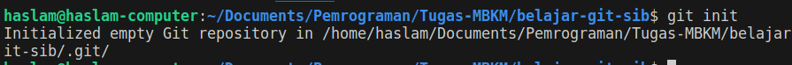

<b>TUGAS VERSION CONTROL SYSTEM DENGAN GIT</b>

### FastFoward

1. Inisialisasi proyek pertama, dengan membuat folder dan memberikan `git init` sebagai penanda bahwa folder ini menggunakan _VCS_ 

    

2. membuat file didalam proyek, lalu gunakan `git add nama_file` untuk merubah posisi dari working directory ke staging area, dan gunakan `git status` untuk mengetahui status file yang sudah berada di staging area. Dan terakhir gunakan `git commit -m "pesan" nama_file` untuk memasukkan perubahan dalam repository git lokal

    
    
    

3. merubah nama main branch ke `Parent` dengan command `git branch -m nama_brach_lama nama_branch_baru`, lalu membuat perubahan pada file. Dan gunakan `git add` serta `git commit`. Dan lihat untuk log perubahan yang ada `git log`

    
    
    

4. membuat branch baru `git branch nama_branch`, dan switch ke branch tersebut `git switch nama_branch`. Dan buat perubahan pada file branch child lalu pindahkan ke staging area dan commit

    
    

5. melihat log sebelum merge parent dan child `git log --oneline`, dan pindah ke branch utama(parent) untuk menggabungkan branch cabang(child) dengan command `git merge nama_branch`, lalu cek dengan log melihat perubahan. NOTE: Branch main/master adalah branch utama tidak untuk di otak-atik untuk hal yang tidak perlu.

    
    
    

6. me remote repository cloud, sebagai wadah proyek. `git remote add nama_panggilan_remote ssh_repo` dan selanjutnya push parent beserta child `git push nama_repo nama_branch`. 

    
    
    

## Three way

1. clone proyek yang ada di repo `git clone nama_ssh`, lalu skema untuk terjadinya conflit adalah perbedaan kode yang ada pada branch parent dan child yang sebelumnya dibuat. Dengan cara berpindah ke branch parent dan child lalu berikan penambahan line pada file _teks yang berbeda_, dan selanjutnya di push. Konsep ini sama dengan merge sebelumnya tetapi dalam proyek kerja Tim. Ada bagian orang lain yang akan meriview apakah kode itu layak untuk di merge di branch utama.

    
    
    
    

2. terjadi conflict karena pada file yang sama README.md terjadi perubahan berbeda prespektif diantara branch,.ini yang perlu kita solve dan push kembali ketika conflict telah kita selesaikan. Lalu kita selanjutnya pull merge atau meminta persetujuan untuk adanya merge ke branch utama. 

    
    
    