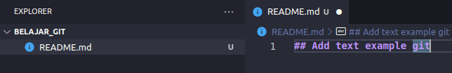
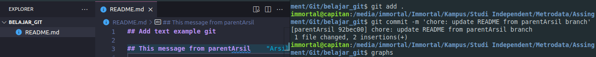
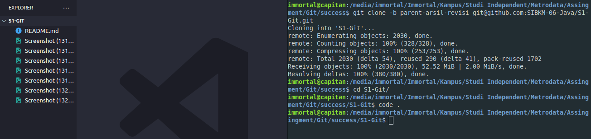

# Versioning

#### Dibuat Oleh Muhammad Arsil Alhabsy

## Fast Forward Merge

1. Buat project baru (menggunakan git init)

   Melakukan insialisasi project dengan git secara local cukup dengan menggunakan perintah `git init`

2. Menambahkan file README.md

   Disini saya menggunakan README.md untuk melakukan pengetesan penerepan git.

3. Mengecek status branch (main), ketika di update

   Untuk melakukan pengecekan dimana terjadi perubahan pada suatu branch pada git, cukup menggunakan perintah `git status`

4. Tampilan status branch (main), ketika di `add .`

   Printah `add .` bermakna memindahkan perubahan dari _working directory_ ke _staging area_

5. Melalukan commit

   `commit -m '<message>'` adalah perintah untuk menyimpan suatu perubahan dari _staging area_ ke _directory git_

6. Menambahkan branch baru (parentArsil)

   Perintah yang diggunakan untuk menambah branch baru ialah

   - `git branch <nama branch>` hanya membuat branch baru, diperlukan `git checkout <nama branch>` untuk berpindah dari branch sebelumnya ke branch target
   - `git checkout -b <nama branch>` membuat branch baru dan berpindah branch secara langsung

7. Melakukan update README.md pada branch (parentArsil)

8. Menambahkan branch baru (childArsil)

9. Melakukan merge dari branch (childArsil) ke branch (parentArsil)

   printah yang diggunakan untuk melakukan merge dari branch satu ke beranch yang lainnya adalah `git merge <nama branch target>`, pastikan anda berada pada branch yang ingin mengambil code bukan branch yang memiliki code.

10. Tampilan graphs pada keseluruhan branch

    Untuk menampilkan graphs bisa dengan printah `git log --all --decorate --oneline --graph`. Namun disini saya telah menambahkan alias pada komputer, yang berfungsi untuk mempersingkat kode ketika melihat graphs dari git `alias graphs='git log --all --decorate --oneline --graph'`

11. Menyelaraskan keseluruhan branch dengan melakukan merge dari master

  

## Three way marge

1. Melakukan clone dari branch main yang ada pada organization

2. Menambah dan menuliskan sesuatu pada file `.txt`

3. Melakukan origin pull request dari branch `parent-arsil-revisi`

4. Melakukan perubahan dan penambahan file pada branch `child-arsil`

5. Kembali ke branch parent untuk melakukan perubahan pada `file2.txt`

6. Berpindah ke branch `child-arsil` untuk melakukan pull request

7. Berikut merupakan tampilan graphs dari three way merge, setelah di solve confictnya

8. Melakukan push pada `child-arsil`

9.  Melakukan pull request dari parent ke child

10. Melakukan create pull requests

11. Melakukan pull dari parent kembali

