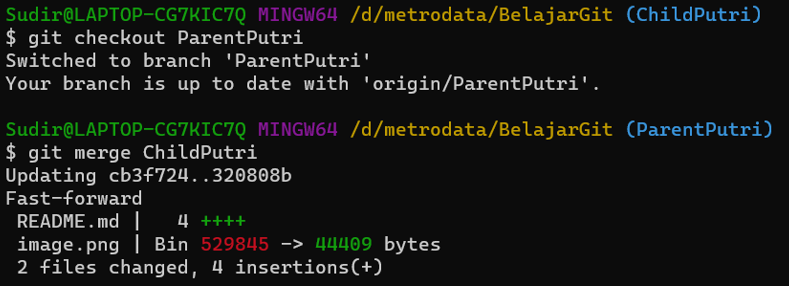

# TUGAS VERSIONING

# Langkah Pertama
- Buatlah Folder Baru contoh "Belajar_Git" Kemudian Buka  folder tersebut

- Selanjutnya ketik git init 

- selanjut nya git status untuk mengecek sebuah perubahan 

- Tambahkan "git add" + "git commit + git log 

- "git checkout -b "childTamaraRevisi" untuk membuat sekaligus berpindah ke branch baru
-  "git checkout -b "ParentTamaraRevisi" untuk membuat sekaligus berpindah ke branch baru

- Terlihat di gambar atas bahwa child dan parent sudah sama.
- Remote dan Push branch parent ke repostory "github git remote add origin git@github.com:SIBKM-06-Java/S1-Git.git"

Terlihat pada gambar diatas bahwa git remote ku sudah ada dikarenakan saya memakai folder sebelumnya yang sudah saya buat dan pakai 

# Langkah Kedua 
- Three Ways Merge 
- Lakukan clone tetapi kita harus keluar dari branch dan mengecek branch parent dan child

-Selanjutnya pull branch child ke parents

- Selanjutnya Terjadi ERROR yang saya tidak tau apa yang salah, sudah mencoba tetapi tetap ERROR  

- Selanjutnya upload ke Git Hub

