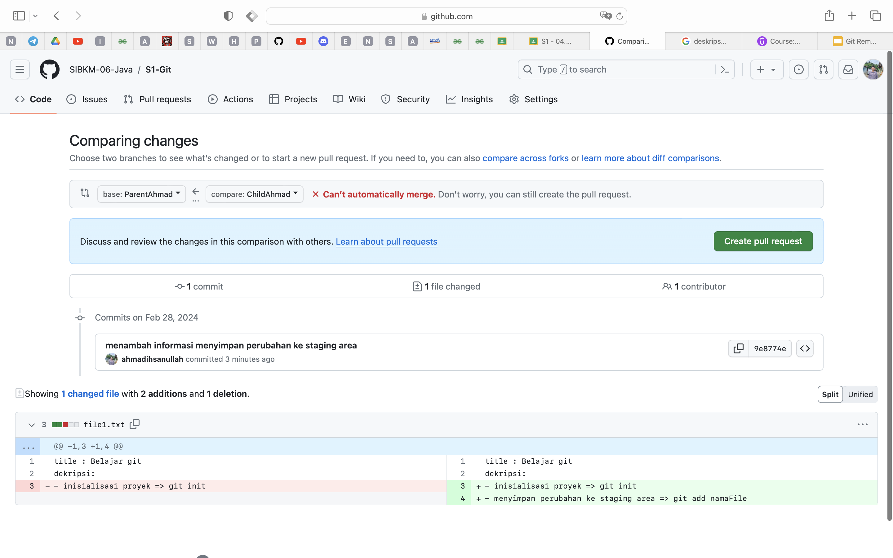

# Git - Merge
Menggabungkan 2 branch yang berbeda menjadi satu
# 1.  Fast Forward Merge

Fast forward merupakan sebuah kasus dimana terdapat 2 branch yang melakukan merge di 1 jalur yang sama, sehingga terhindar dari konflik

## Studi Kasus

Mencoba melakukan studi kasus fast-forward di repository sederhana.
Terdapat 2 branch: 
- Branch Parent
    - Branch parent akan membuat sebuah file, dengan mengisi judul saja
- Branch Child
    -   Branch cild akan menambah kan informasi pada file yang sudah dibuat oleh Branch Parent

Branch Parent akan melakukan merge dengan Branch Child untuk mendapatkan informasinya. Sehingga setelah proses selesai maka Branch Parent akan mendapatkannya tanpa terjadi konflik. pada proses inilah yang dimaksud **fast-forward merge**

## Preview
### langkah 1


Inisialisasi Proyek git repository
```bash
git init
```
___

### langkah 2

Mengecek perubahan yang terjadi, dimana branch utama menambah file1.txt dan memberi title: Belajar git. Hasilnya memberi tahu bahwa status saat ini, ada file yang masih berada di working directory
```bash
  git status
```
___

### langkah 3

Melakukan git add . untuk memindahkan file yang masih ada di working directory ke staging area. Artinya file sudah disiapkan untuk disimpan secara permanen di repository
```bash
  git add .
```
Mencek kembali status setelah melakukan git add . , dimana saat ini terdapat status bahwa file siap untuk di commit
```bash
  git status
```
___

### langkah 4

Melakukan commit dengan message "add file1.txt"
```bash
  git commit -m "add file1.txt"
```
___

### langkah 5

Melihat informasi log commit. disini terlihat bahwa pointer saat ini berada branch utama
```bash
  git log --oneline 
```
atau
```bash
  git log --all --decorate --oneline --graph
```
___

### langkah 6

Membuat branch child
```bash
  git branch ChildAhmad
```

___
### langkah 7

rename branch master ke ParentAhmad
```bash
  git branch -m ParentAhmad
```

___
### langkah 8

Melihat log kembali setelah menambahkan branch child, dimana brach ParentAhmad dan ChildAhmad berada di posisi yang sejajar.
```bash
  git log --all --decorate --oneline --graph
```


___
### langkah 9


Pindah branch ke ChildAhmad
```bash
  git switch ChildAhmad
```

___
### langkah 10

Melakukan perubahan pada file1.txt dengan menambahkan deskripsi di branch ChildAhmad. artinya perubahan hanya terlihat di branch ChildAhmad. lalu cek statusnya, sekarang file statusnya dimodifikasi dan berada di working directory.
```bash
  git status
```


___
### langkah 11

Memindahkan file1.txt ke staging area di branch ChildAhmad, lalu cek statusnya. Dan statusnya bahwa perubahan siap untuk di commit
```bash
  git add .
```
```bash
  git status
```

___
### langkah 12

Commit dan beri pesan pada perubahan yang terjadi ChildAhmad
```bash
  git commit -m "menambah deskripsi pada file1.txt"
```


___
### langkah 13

melakukan log untuk melihat posisi commit saat ini, yang mana ChildAhmad berada 1 diatas ParentAhmad untuk commitnya.

```bash
  git log --all --decorate --oneline --graph
```


___
### langkah 14

Pindah branch ke parent

```bash
  git log switch ParentAhmad
```

___
### langkah 15

melakukan log dan melihat bahwa pointer saat ini berada di ParentAhmad dan dia berada dibawah ChildAhmad. Dan kita bisa lihat didalam file1.txt deskripsi yang ditambahkan oleh branch ChildAhmad sudah tidak ada, karena perubaha itu terjadi hanya di branch ChildAhmad

```bash
  git log switch ParentAhmad
```

___
### langkah 16

Melakukan merge dengan branch ChildAhmad, yang mana semua perubahan yang ada di CildAhmad akan ditarik ke branch ParentAhmad. Kita dapat melihatnnya di dile1.txt bahwa deksripsinya sekarang sudah ada

```bash
  git merge ChildAhmad
```

___
### langkah 17

Melihat log, dimana sekarang branch ParentAhmad dan ChildAhmad sudah sejajar. bukan dibawah nya

```bash
  git log --all --decorate --oneline --graph
```

# 2. Git - Three Way Merge
Percabangan yang tidak 1 jalur. Hal ini disebabkan, satu file diubah di branch yang berbeda, sehingga ketika di merge, kita perlu melakukan yang namanya Merge Conflict

## Studi Kasus
Disini kita mencoba melakukan cloning project dari github. Dan nantinya terdapat 2 branch yaitu ParentAhmad dan CHildAhmad. kita akan mencoba mengubah 1 file yang sama di baris sama di 2 branch itu, lalu kita push ke github dan melakukan merge disana menggunakan pull request. ParentAhmad <- ChildAhmad, disini kita mencoba menggabungkan ChildAhmad ke ParentAhmad yang nantinya akan terjadi merge conflict dikarenakan kedua branch melakukan perubahan di baris yang sama pada file yang sama.

Nantinya kita akan coba mensolve masalah ini di local repository dan di push kembali ke github.


## Preview
### langkah 1

Clone Project
```bash
  git clone git@github.com:SIBKM-06-Java/S1-Git.git
```
___

### langkah 2

Melihat semua branch yang terdapat di remote (github)
```bash
  git branch -a
```
___

### langkah 3

Membuat branch ParentAhmad dan ChildAhmad yang mengarah kepada branch diremote origin/ParentAhmad dan origin/ChildAhmad

```bash 
  git checkout -b ParentAhmad origin/ParentAhmad
```

```bash 
  git checkout -b ChildAhmad origin/ChildAhmad
```
___

### langkah 4

Melihat daftar branch di local
```bash
  git branch 
```
___

### langkah 5

Melakukan perubahan pada file1.txt di baris ke, dan mencek statusnya yang masih di working directory

```bash
git status
```

___

### langkah 6

add perubahan kedalam stagin area
```bash
  git add .
```

### langkah 7

commit dan push perubahan ke dalam github
```bash
git commit -m "menambah informasi status commit di file1.txt"
```

```bash
git push origin ParentAhmad origin/ParentAhmad
```
___
### langkah 8

Melihat perubahan yang sudah masuk kedalam github


___
### langkah 9


Melihat history commit menggunakan log. Dimana branch local dan remote nya ParentAhmad sudah berada diatas Child(pointer saat ini)
```bash
  git branch --all --decorate --oneline --graph
```
___
### langkah 10

Melakukan perubahan di file1.txt di baris keempat di branch childAhmad. dan mencek statusnya
```bash
git status
```


___
### langkah 11

add perubahan ke stagin area. untuk melihat perubahannya gunakan git status
```bash
git add
```
```bash
git status
```

___
### langkah 12

commit perubahan dan berikan pesan
```bash
git commit -m "menambah informasi penyumpanan perubahan ke stagin area"
```


___
### langkah 13

Push branch ChildAhmad ke github 
```bash
  git push origin ChildAhmad origin/ChildAhmad
```
___
### langkah 14

Melihat perubahan yang sudah masuk kedalam branch ChildAhmad di remotenya/github
___
### langkah 15

Mencoba melakukan merge di github dengan pull request, dimana branch ParentAhmad akan merge dengan ChildAhmad. Namun terdapat pesan bahwa ini tidak bisa otomatis di merge.
___
### langkah 16

Setelah kita klik Create pull request terdapat info kembali bahwa branch ini terjadi konflik sehingga harus diselesaikan terlbih dahulu. Github menawari untuk menyelesaikan masalah itu langsung dari platformnya, namun pada kasus ini kita coba memperbaikinya di local terlebih dahulu

___
### langkah 16.1

Sekarang kita coba melakukan merge di local dari ParentAhmad ke ChildAhmad. Secara otomatis terdapat pesan yang sama yaitu terdapat konflik dan harus diselesaikan.
```bash
  git merge ParentAhmad
```


___
### langkah 17

Kita dapat menyelesaikan dengan mengambil kedua perubahan antara ChildAhmad dan ParentAhmad

___
### langkah 18

Jika sudah kita bisa tambah perubahan, commit dan push kembali ke github.
```bash
  git add .
```

```bash
  git commit -m "fix conflict in fle1.txt"
```

```bash
  git push origin ChildAhmad
```

___
### langkah 19

Secara otomatis jika kita kembali ke github status dari pull request kita berubah menjadi merge pull request sehigga kita bisa melakukan merge di github.

___
### langkah 20

Untuk melihat perubahan yang terjadi di github menggunkakan fitu Files Changed

### langkah 21
___

Setelah merasa yakin bahwa branch sudah siap di merge kita bisa memberi pesan dan confirm merge

### langkah 22
___

status merge sukses

### langkah 23
___

Jika kita ingat bahwa merge terjadi di remote, sehingga branch ParentAhmad yang dilocal belum menerima perubahan tersebut untuk menarik perubahan terbaru yang ada diremote kita bisa menambahakan perintah git pull di branch ParentAhmad otomatis perubahan apapun yang terjadi di branch remote ParentAhmad akan ditarik ke local

```bash
git pull origin/ParentAhmad
```
