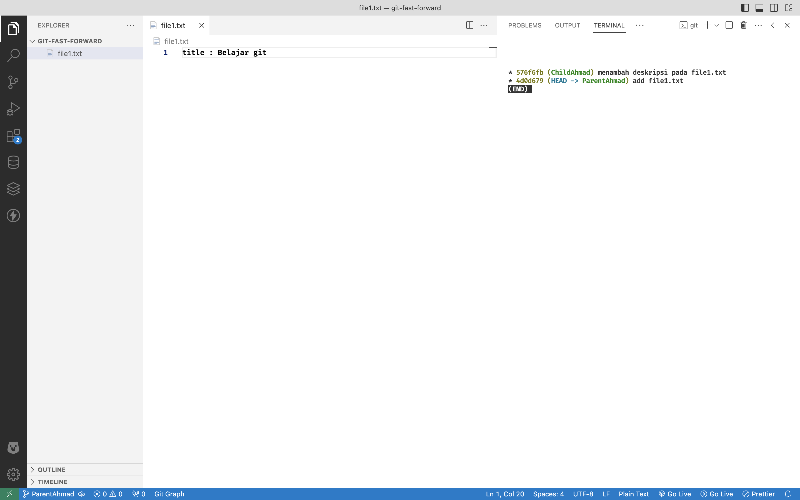

# Git - Fast Forward Merge

Fast forward merupakan sebuah kasus dimana terdapat 2 branch yang melakukan merge di 1 jalur yang sama, sehingga terhindar dari conflict.

## Studi Kasus

Mencoba melakukan studi kasus fast-forward di repository sederhana.
Terdapat 2 branch: 
- Branch Parent
    - Branch parent akan membuat sebuah file, dengan mengisi judul saja
- Branch Child
    -   Branch cild akan menambah kan informasi pada file yang sudah dibuat oleh Branch Parent

Branch Parent akan melakukan merge dengan Branch Child untuk mendapatkan informasinya. Sehingga setelah proses selesai maka Branch Parent akan mendapatkannya tanpa terjadi konflik. pada proses inilah yang dimaksud **fast-forward merge**

## Preview


Inisialisasi Proyek git repository
```bash
  git init
```
___


Mengecek perubahan yang terjadi, dimana branch utama menambah file1.txt dan memberi title: Belajar git. Hasilnya memberi tahu bahwa status saat ini, ada file yang masih berada di working directory
```bash
  git status
```
___


Melakukan git add . untuk memindahkan file yang masih ada di working directory ke staging area. Artinya file sudah disiapkan untuk disimpan secara permanen di repository
```bash
  git add .
```
Mencek kembali status setelah melakukan git add . , dimana saat ini terdapat status bahwa file siap untuk di commit
```bash
  git status
```
___


Melakukan commit dengan message "add file1.txt"
```bash
  git commit -m "add file1.txt"
```
___


Melihat informasi log commit. disini terlihat bahwa pointer saat ini berada branch utama
```bash
  git log --oneline 
```
atau
```bash
  git log --all --decorate --oneline --graph
```
___


Membuat branch child
```bash
  git branch ChildAhmad
```
___

rename branch master ke ParentAhmad
```bash
  git branch -m ParentAhmad
```

___

Melihat log kembali setelah menambahkan branch child, dimana brach ParentAhmad dan ChildAhmad berada di posisi yang sejajar.
```bash
  git log --all --decorate --oneline --graph
```


___

Pindah branch ke ChildAhmad
```bash
  git switch ChildAhmad
```

___

Melakukan perubahan pada file1.txt dengan menambahkan deskripsi di branch ChildAhmad. artinya perubahan hanya terlihat di branch ChildAhmad. lalu cek statusnya, sekarang file statusnya dimodifikasi dan berada di working directory.
```bash
  git status
```


___

Memindahkan file1.txt ke staging area di branch ChildAhmad, lalu cek statusnya. Dan statusnya bahwa perubahan siap untuk di commit
```bash
  git add .
```

```bash
  git status
```

___

Commit dan beri pesan pada perubahan yang terjadi ChildAhmad
```bash
  git commit -m "menambah deskripsi pada file1.txt"
```


___

melakukan log untuk melihat posisi commit saat ini, yang mana ChildAhmad berada 1 diatas ParentAhmad untuk commitnya.

```bash
  git log --all --decorate --oneline --graph
```


___

Pindah branch ke parent

```bash
  git log switch ParentAhmad
```

___

melakukan log dan melihat bahwa pointer saat ini berada di ParentAhmad dan dia berada dibawah ChildAhmad. Dan kita bisa lihat didalam file1.txt deskripsi yang ditambahkan oleh branch ChildAhmad sudah tidak ada, karena perubaha itu terjadi hanya di branch ChildAhmad

```bash
  git log switch ParentAhmad
```

___

Melakukan merge dengan branch ChildAhmad, yang mana semua perubahan yang ada di CildAhmad akan ditarik ke branch ParentAhmad. Kita dapat melihatnnya di dile1.txt bahwa deksripsinya sekarang sudah ada

```bash
  git merge ChildAhmad
```

___

Melihat log, dimana sekarang branch ParentAhmad dan ChildAhmad sudah sejajar. bukan dibawah nya

```bash
  git log --all --decorate --oneline --graph
```
