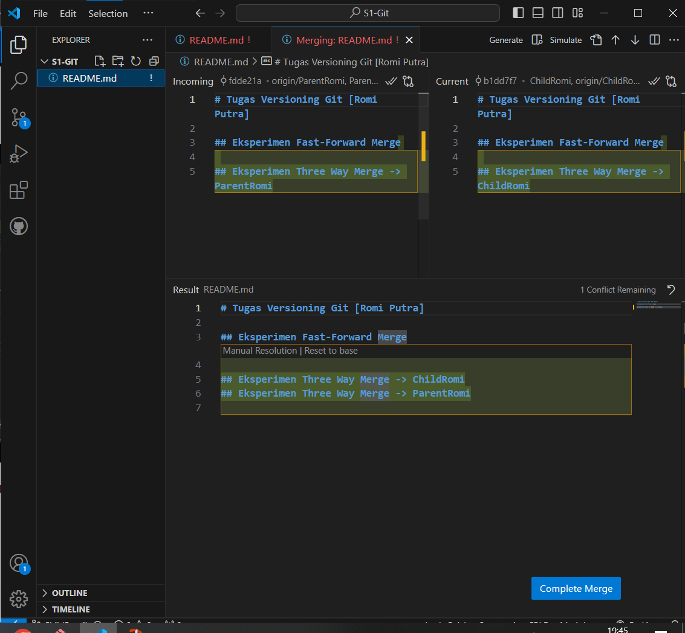

# Tugas Versioning Git [Romi Putra]

## Eksperimen Fast-Forward Merge

## Eksperimen Three Way Merge -> ChildRomi
## Eksperimen Three Way Merge -> ParentRomi

# Laporan

## Fast-Forward Merge
1. 
- Buat directory local baru dan salin path-nya pada git bash

- Masukkan command `git init` untuk membuat local repo di directory

- Buka text editor dan buat file *README.md* pada text editor atau command `touch [Namafile]`

- Rename branch *master* menjadi branch *Parent[Nama]*

- Tambahkan konten pada *README.md*

- File *README.md* masih pada status untracked (`git status`), Lakukan `git add *` ke staging arena dan `git commit -m "[message]" ` melakukan commit pertama

- Untuk melihat history commit dapat menggunakan command ` git log --decorate --oneline --graph`

- Buat branch *Child[Nama]* dan pindah langsung dengan command `git checkout -b [NamaBranch]` (Argumen -b untuk membuat branch baru)

- untuk Tambahkan konten di text editor *README.md* pada branch child

- Lakukan add dan commit pada branch child, karena tidak menambah file dapat langsung dengan argumen `git commit -am "[Message]"`

- Jika dilihat history commit kedua branch, maka akan terlihat bahwa branch parent tertinggal

- Pada parent directory, lakukan Fast Forward Merge dengan command `git merge [branch]` dan history commit seharusnya sudah menyatu

- Lakukan koneksi dengan remote GitHub. Cek koneksi dengan `git remote -v` dan hubungan dengan repository dengan `git remote add origini [SSH]`

- Lakukan `git push` untuk menyimpan perubahan di repository GitHub untuk kedua branch

## Three Way Merge
- Copy path dari directory yang akan digunakan pada git bash, dan lakukan `git clone [Link Repo]` pada directory tersebut

- Gunakan `git checkout` untuk mendeteksi branch yang kita gunakan pada local

- Tambahkan konten di *README.md* untuk branch Parent

- Lakukan `git commit -am "[Message]"` untuk menyimpan commit pada parent

- Lakukan `git push` Untuk menyimpan perubahan branch Parent pada remote GitHub

- Pindah ke branch child dan tambahkan konten di *README.md* untuk branch Child, lalu lakukan `git commit -am "[Message]"` untuk menyimpan commit pada child

- Lakukan `git push` Untuk menyimpan perubahan branch child pada remote GitHub

- Lakukan `git pull` pada branch Child untuk memulai me-resolve conflict pada branch Child

- Lakukan Three Way Merge pada text editor. Pada kasus ini dipilih 'Accept Both Changes' atau hapus baris kode yang kita tidak ingin simpan. Setelah itu, klik 'Complete Merge'

- Lakukan `git commit` untuk menyimpan perubahaan Three Way Merge pada Child branch

- Untuk merge pada branch Parent akan dilakukan dengan Pull Request. Masuk ke menu Pull Request di Repository GitHub

- Pada menu selanjutnya, tentukan base nya sebagai branch Parent dan compare adalah branch Child. Beri Title dan Description. Set asginees menjadi diri sendiri, dan Reviewer adalah supervisor.

- Jika terdapat tombol `Resolve Conflict` pada pull request kita, maka selesaikan dengan menentukan line yang disimpan dan tekan `Merge Conflict`

- Setelah itu, kita dapat kembali ke halaman Pull Request kita dan klik `Merge pull request`

- Setelah itu, branch Parent sudah terupdate!

