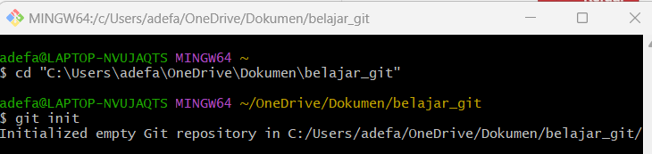
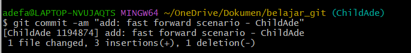
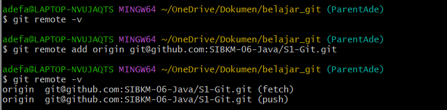

# Versioning

### Dibuat Oleh Ade Fanca Amanda
#
## Laporan Tugas Git
#
## 1. membuat folder baru dengan nama belajar_git

#
## 2. membuka git bash lalu mencopy link directory folder yang sudah kita buat, lalu menghubungkan git ke git bash dengan code  **`cd"C:\Users\adefa\OneDrive\Dokumen\belajar_git"`** dan melakukan git init

#
## 3. lalu saya merename bramch master menjadi branch ParentAde dengan code **`$git branch -m master ParentAde`**, setelah itu langsung buka visual studio code dengan code **`code .`**, lalu membuat file **`README.md`**

#
## 4. cek status apakah didalam branch ParentAde sudah ada file **`README.md`** yang sudah kita buat.

#
## 5. membuat branch ChildAde, setelah itu update README.md untuk branch ChildAde

#
## 6. melakukan fast forward dengan code **`$git commit -am "add: fast forward scenario - ChildAde"`**

#
## 7. Melakukan Fast Forward secara merge di terminal dengan code **`git merge ChildAde`**

#
## 8. menambahkan remote untuk menghubungkan path git dengan repository di github.
pertama kita cek menggunakan code **`git remote -v`**, jika kosong gunakan code ini **`git remote add origin git@github.com:SIBKM-06-Java/S1-Git.git`**, jika sudah kita bisa mengecek ulang dengen code **`git remote -v`**

#
## 9. melakukan push pada ParentAde dan ChildAde dengan menggunakan code ini untuk push ParentAde**`$ git push --set-upstream origin ParentdAde`** dan code ini untuk push ChildAde **`$ git push --set-upstream origin ChildAde`** 

#
## untuk pushnya lagi bisa ikutin langkah ini, **`git status`** lalu **`git add .`** lalu **`git commit -m "add: laporan tugas"`** dan **`git push`**

#
## untuk keseluruhan codenya

#
# jika ada yang salah terhadap langkah"nya mohon para sepuh bisa diajarin

# Terima Kasih

### Three Way Merge - ParentAde