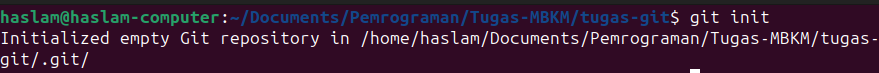
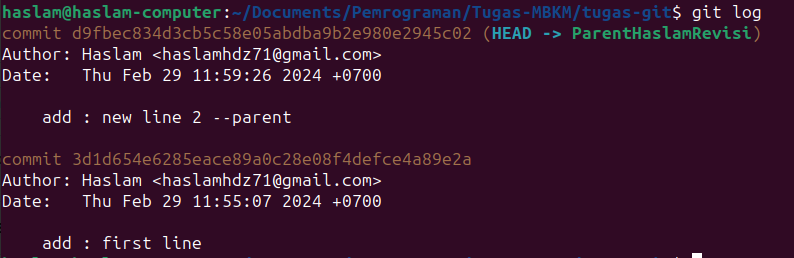
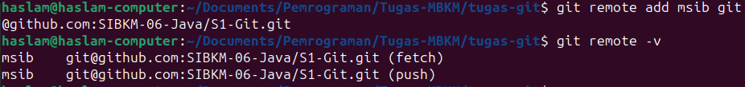

<b>TUGAS GIT MBKM-JAVA METRODATA</b>

---

### Local Versioning Command

1. `git init` digunakan untuk inisialisasi proyek dengan sistem kontrol versi menggunakan GIT
   

2. `git add nama_file` digunakan untuk memindahkan ke area penyiapan (staging area), atau untuk menambahkan perubahan dalam file, bisa menggunakan `git *` untuk semua file 
   

3. `git commit -m "pesan_untuk_commit"` digunakan untuk memindahkan ke area lokal repository
    

4. `git branch nama_branch` digunakan untuk membuat branch baru, ketika suatu file ingin kerjakan secara terpisah dengan inti file
    

5. `git branch` digunakan untuk melihat branch yang ada, dan ditandai dengan warna hijau untuk branch yang digunakan saat ini
    

6. `git status` digunakan untuk melihat status file yang ada, apakah masih di working directory atau staging area
    

7. `git checkout nama_branch` digunakan untuk pindah branch ke branch lainnya. Digunakan untuk memisahkan dengan file inti atau penambahan file lainnya
    

8. `git log` digunakan untuk melihat log perubahan dari file/projek yang kita kerjakan
    

9. `git checkout hash_code_log nama_file` digunakan apabila kita ingin melihat isi versi file sebelumnya
    

10. `git checkout HEAD nama_file` digunakan untuk berpindah ke file saat ini/main/utama/head setelah pindah ke versi sebelumnya
    

11. `git rm --cached nama_file` digunakan untuk mengembalikan posisi dari staging area ke working direktori atau mencancel perubahan lokal
    

12. `git merge nama_branch_sebelumnya` digunakan untuk merge branch, dimana dalam kasus ingin menjadikan branch X ke main branch atau file inti
    

### Repository Command

1. `git clone ssh_git` digunakan untuk mengcopy git folder yang ada 
    

2. `git remote add nama_panggilan_remote ssh_remote_git` digunakan untuk berkerja dalam satu repository atau meremote
    

3. `git remote -v` digunakan untuk melihat remote apa saja yang dimiliki pada folder lokal
    

4. `git remove nama_remote` digunakan untuk menghapus remote yang ada
    

5. `git push nama_remote nama_branch_ke_repository` digunakan untuk push file yang dikerjakan ke repository remote
    

6. `git pull nama_branch_remote nama_branch_tujuan` digunakan untuk memfetch atau menarik perubahan yang ada pada repository ke lokal dengan nama branch tujuan
    
