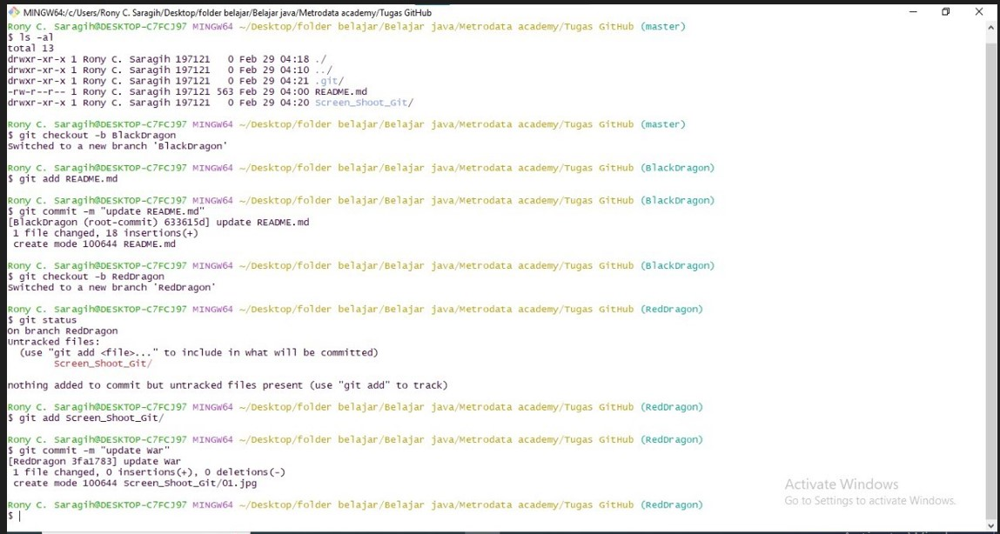

# Melakukan Fast Forward
 
 1. `Melakukan git init`

    

 2. `membuat branch baru dengan nama BlackDragon, membuat perubahan dan membuat branch baru` 
    `dan juga mengubah isi dari brach`

    

 3. `menggabungkan antara dua buah branch`

    

# Melakukan Three Way Merge

`Melakukan git init`

`membuat branch baru dengan nama BlackDragon, membuat perubahan dan membuat branch baru  `
`dan juga mengubah isi dari brach"

` menggabungkan antara dua buah branch`

` Membuat dan sekaligus mengubah commit dari branch WhiteDraogon`

` menggabungkan antara ketiga branch Satu samayang lain`

