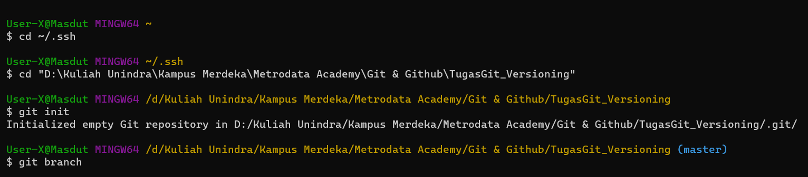

# **Tugas 1 : Versioning**

### Laporan tugas Git
- Implementasi yang sudah dipelajari terkait Git
- Buat skenario Fast-Forward dengan membuat branch Parent: ex. ParentNama & branch Child: ex. ChildNama

## **Fast-Forward**
#### Melakukan inisialisasi repository di dalam komputer, dengan cara mengcopy directory file dan dicetak pada terminal untuk menjalankan Git

#### Berdasarkan ketentuan soal, branch parent master diubah menjadi ParentDutaRevisi

#### Mengetik "code ." pada terminal untuk memanggil suatu IDE, lalu membuat file README.md sebagai main file untuk menjalankan Git. Lakukan commit pada terminal Git supaya file dapat digunakan

#### Buat beberapa data untuk branch parent

#### Buat branch child dengan set nama branch ChildDutaRevisi. Buat beberapa data supaya branch child tidak kosong.

#### Kembali ke branch parent dan lakukan merge branch child terhadap branch parent supaya kondisi Fast-Forward terpenuhi.
 

#### Query Git diatas telah ditampilkan dan dijelaskan secara urut. Selanjutnya akan dilanjutkan SS Git untuk Fast-Forward.

## **Three Way Merge**