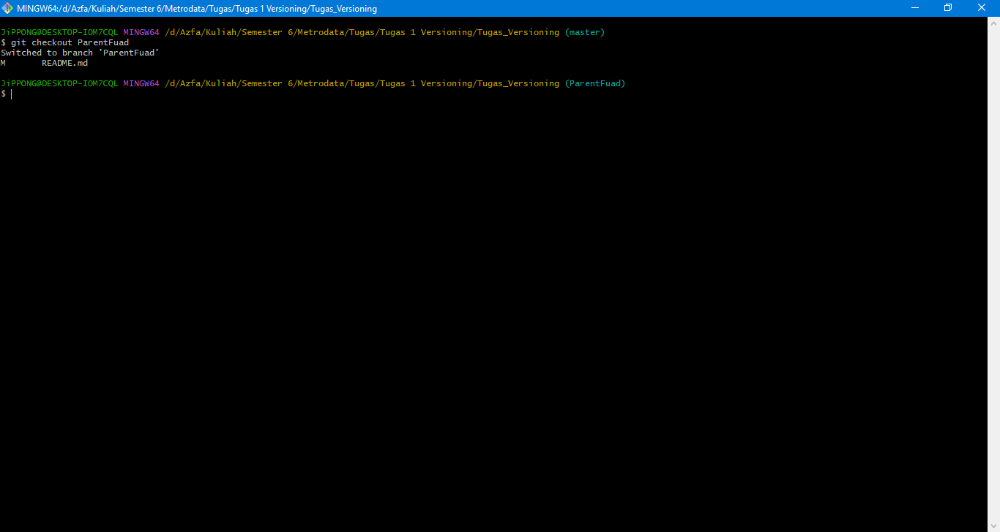
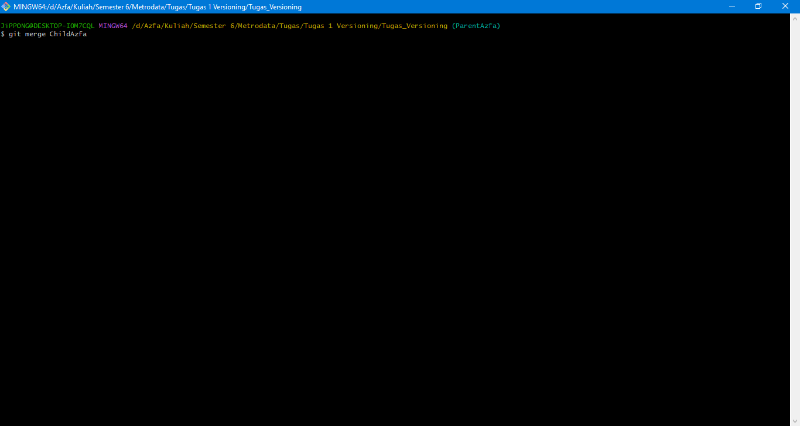
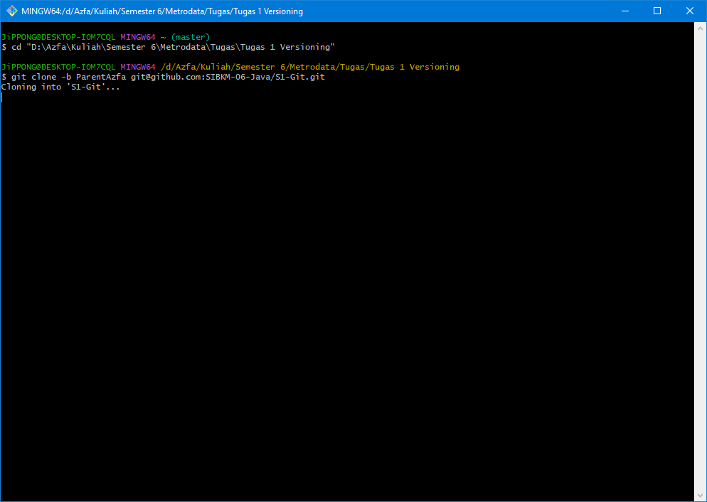
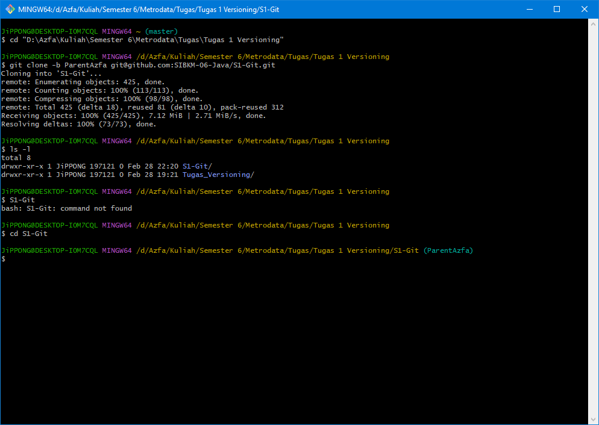
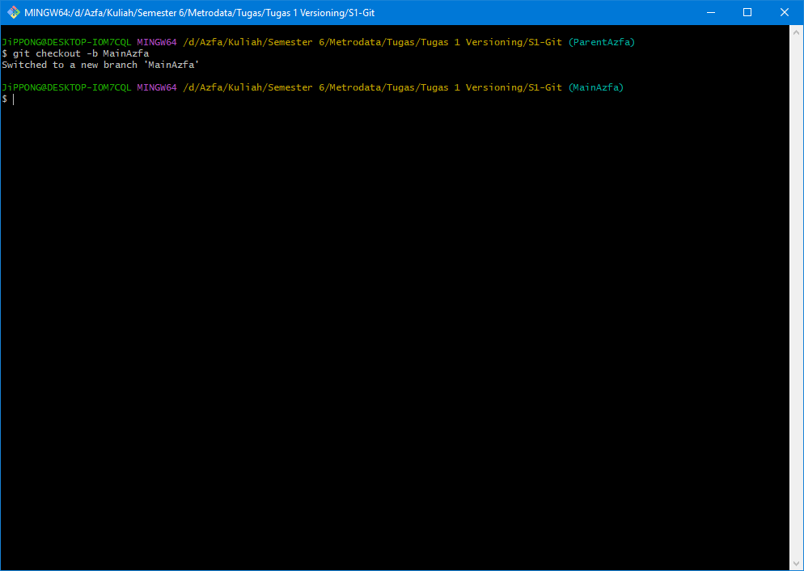
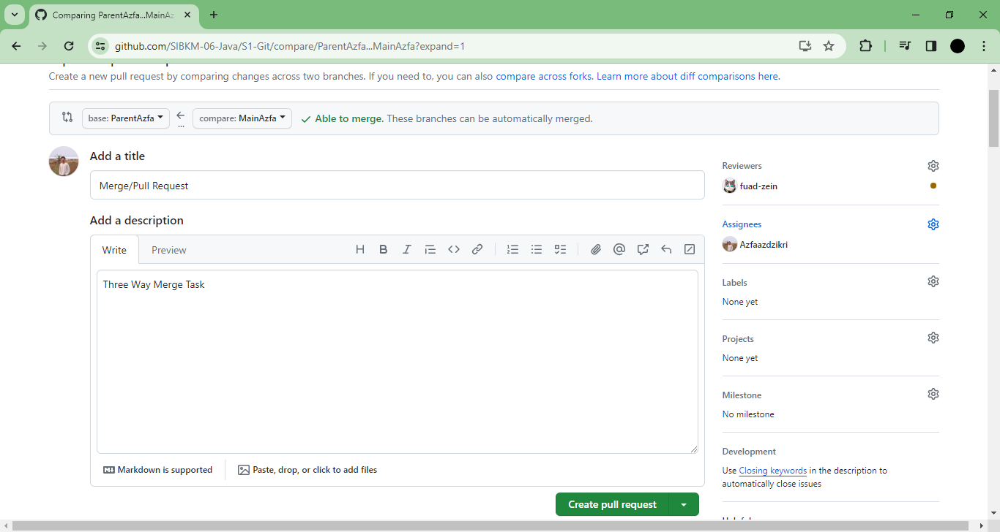

# 
 Tugas 1

 Versioning

  

 Muhammad Azfa Az-Dzikri 

 2103075 

 Studi Independen Bersertifikat Kampus Merdeka Batch 6 

 2024

# Fast Forward
1. Membuat Folder Project

  

2. Melakukan git branch untuk menambahkan ke branch master

  

3. Membuat File README.md pada IDE untuk menambahkan pada file project

  

4. Menambahkan git init pada gitbash untuk menambahkan ke working direcotry 

  

5. Menambahkan git add pada gitbash untuk menambahkan ke staging area/ unmodified project

  

setelah menambahkan git add project akan manjadi unmodified yang berasal dari untracker

  

6. Menambahkan git commit untuk memasukan ke local Repository

  

7. Switch Ke branch ParentAzfa dengan menambahkan git checkout -b ParentAzfa

  

8. Membuat branch child dengan menambahkan git checkout -b ChildAzfa

  

9. Merge ChildAzfa dengan ParentAzfa menggunakan git merge

  

10. Membuat remote origin untuk koneksi ke repository web

  

11. Push ke repositorynya menggunakan git push

  

# Three Way Merge

1. Pull Branch ParentAzfa ke lokal repository Menggunakan git clone -b ParentAzfa git@github.com:SIBKM-06-Java/S1-Git.git

  

2. Pindah Directory ke S1-Git/ otomatis Branch menggunakan ParentAzfa

  

3. Membuat Branch Baru dengan nama MainAzfa dengan git checkout -b MainAzfa

  

4. Commit branch MainAzfa dengan git -commit

  

5. Push ke repository dengan git -push

  

6. Melakukan Pull Request antara Branch ParentAzfa dan MainAzfa

  

7. Melakukan Solve Conflict

