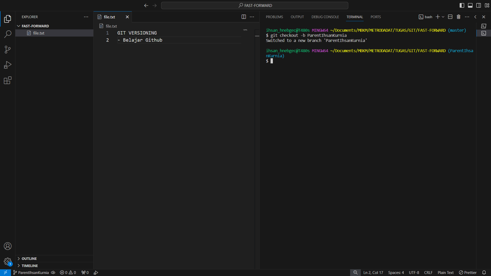
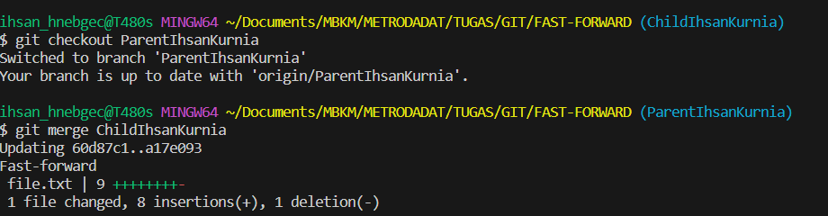
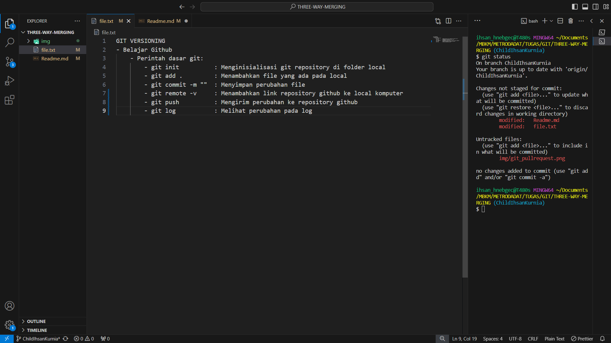
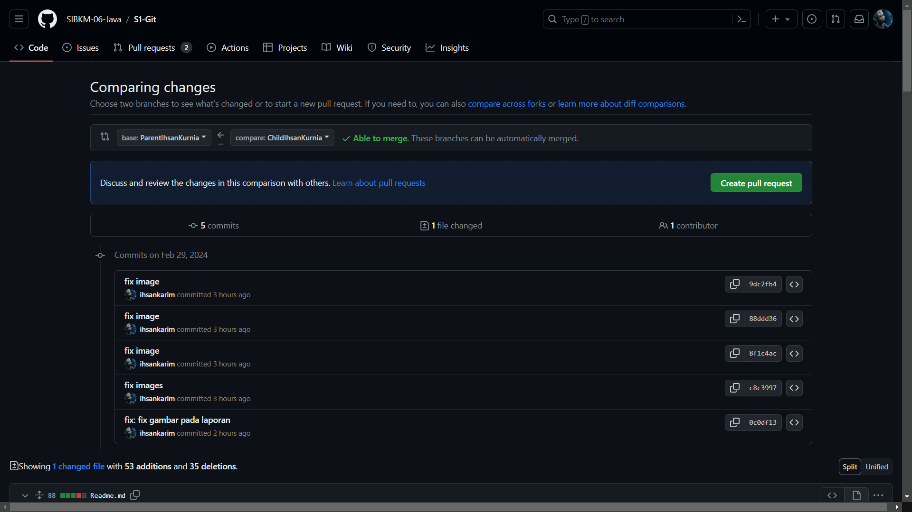
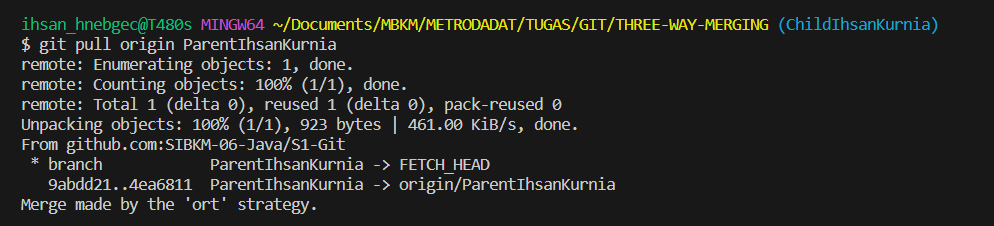
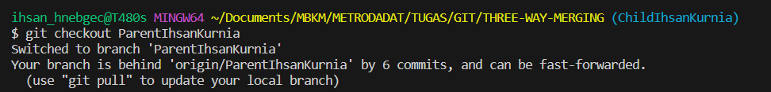
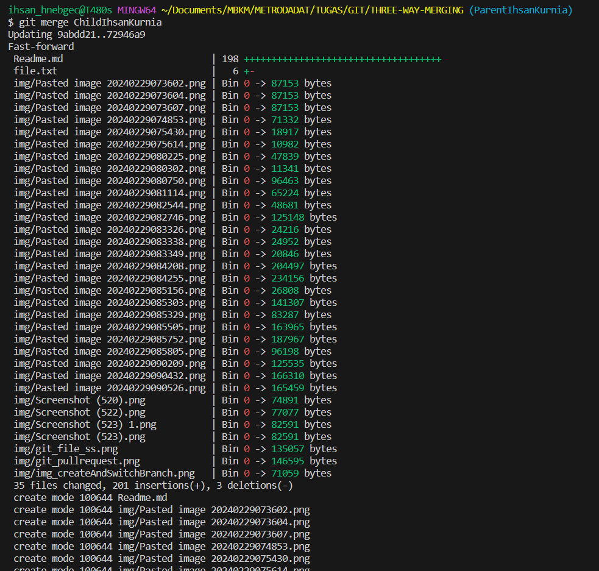
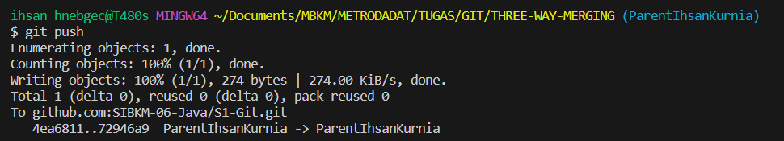

# TUGAS VERSIONING MENGGUNAKAN GITHUB
### MUHAMMAD IHSAN KURNIA AL-KARIM
### METRODATA ACADEMY

## GIT FAST FORWARD  

## Langkah 1

Menginisialisasi git dengan menggunakan perintah berikut ini:

```bash
git init
```

.png>)

## Langkah 2

Membuat file.txt yang nantinya akan di push di repository, setelah itu mengecek perubahan yang ada pada git dengan perintah berikut ini

```bash
git status
```

.png>)

## Langkah 3

Menambahkan dan commit perubahan file.txt dengan perintah berikut ini:
Perintah untuk menambahkan file yang telah dibuat

```bash
git add .
```

Perintah untuk perubahan commit:

```bash
git commit -m "add: menambahkan file.txt"
```

.png>)

## Langkah 4

Membuat branch baru dan berpindah branch menggunakan perintah berikut ini:

```bash
git checkout -b ParentIhsanKurnia
```



## Langkah 5

Menambahkan remote reposiotry dengan SSH reposiotry "git@github.com:SIBKM-06-Java/S1-Git.git" menggunakan perintah berikut ini:

Git remote untuk menyambungkan file ke git repository:

```bash
git remote add origin git@github.com:SIBKM-06-Java/S1-Git.git
```

Perintah untuk mengecek repository github yang tersimpan di local:

```bash
git remote -v
```


## Langkah 6

Membuat branch baru yang bernama"ChildIhsanKurnia":


## Langkah 7

Menghapus branch master dengan command berikut ini:

```bash
git branch -d master
```


Melihat daftar branch yang tersedia di lokal dengan command berikut ini:

```bash
git branch -a
```


## Langkah 8
Push file yang ada di local ke repository dengan perintah berikut ini:

```bash
git push --set-upstream origin ParentIhsanKurnia
```


## Langkah 9
Mengubah isi file.txt dan push ke branch ChildIhsanKurnia

```bash
git push origin ChildIhsanKurnia
```


## Langkah 10 

Pindah ke branch ParentIhsanKurnia
```bash
git checkout ParentIhsanKurnia
```

Menggabungkan seluruh perubahan yang ada di branch ChildIhsanKurnia ke branch ParentIhsanKurnia
```bash
git merge ChildIhsanKurnia
```




## GIT THREE-WAY-MERGING

## Langkah 1

Melakukan cloning dari repository dengan perintah berikut ini:

```bash
git clone git@github.com:SIBKM-06-Java/S1-Git.git THREE-WAY-MERGING
```


## Langkah 2

Melihat daftar branch yang telah tersedia di repository

```bash
git branch -a
```


## Langkah 3
Membuat branch Parent dan Child
```bash
git checkout -b ParentIhsanKurnia origin/ParentIhsanKurnia
```


```bash
git checkout -b ChildIhsanKurnia origin/ChildIhsanKurnia
```


Melihat list branch yang telah tersedia di local:
```bash
git branch
```


## Langkah 4
Membuat perubahan pada file.txt dan melakukan push ke repository:




## Langkah 5

Karena tadi masih berada di branch parent. Maka perlu pindah branch dari ParentIhsanKurnia ke ChildIhsanKurnia


Selain itu, Menambahkan perubahan pada file, seperti pada gambar dibawah ini:


## Langkah 6

### 6.1 Melakukan Pull Request dan merge langsung di github:
Melakukan pull request dan merge dengan perintah dibawah ini


Pull Request dari branch ChildIhsanKurnia ke branch ParentIhsanKurnia langsung di github:




Pull request berhasil dan melakukan merge branch langsung di github:


### 6.2 Melakukan Pull Request dan merge di local

#### Mengambil perubahan terbaru dari remote repository ke dalam branch ParentIhsanKurnia.


#### Memastikan pindah branch ParentIhsanKurnia


#### Menggabungkan perubahan dari branch ChildIhsanKurnia ke dalam branch ParentIhsanKurnia


#### Mengirim perubahan yang telah di-merge ke remote repository.


