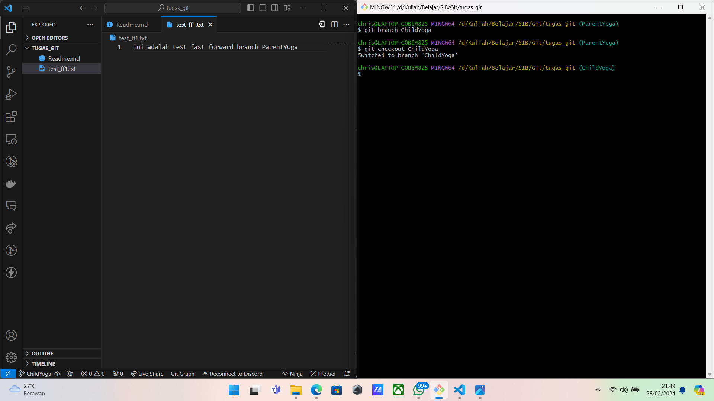
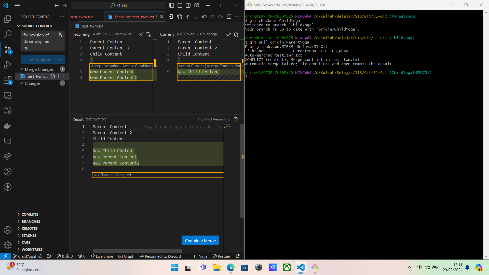

Nama: Christianus Yoga Wibisono

Universitas: Universitas Jember

SIB: Fullstack Java Developer

# Fast Forward

Fast forward merge terjadi ketika branch yang sedang di-merge (misalnya, branch feature) hanya memiliki commit yang tidak ada di branch target (misalnya, branch main).
Jadi, ketika Anda melakukan merge, Git dapat "maju cepat" dengan hanya memindahkan referensi branch tanpa membuat commit merge baru.
Situasi ini terjadi ketika tidak ada perubahan konflik antara kedua branch dan tidak ada commit baru di branch target sejak branch sumber dibuat.

### Langkah-Langkah

##### 1. Buat Folder Projek dan Inisialisasi Git

Buat folder projek dengan menggunakan script bash:

```cs
mkdir <namaprojek>
cd <namaprojek> # pindah ke directory projek
code . # membuka vscode via git bash
```

Setelah itu, bisa langsung menginisialisasi git di dalam foldernya:

```cs
git init
```


##### 2. Buat File Dummy untuk Testing

Buat file bebas yang dipakai untuk melakukan pembelajaran


##### 3. Pindah Branch ke Parent Branch yang Sudah Ditugaskan

Buat branch baru dan switch ke branch tersebut dengan script:

```cs
git branch -m <newbranch>
```


Lalu pindahkan file dummy yang sudah dibuat dari Working Tree ke Staging Area serta melakukan commit dengan script berikut:

```cs
git add .
git status # melihat status git life cycle pada tiap file
git commit -m <message>
```


##### 4. Koneksikan Local Git dengan Remote Git di Github

Koneksikan local git dengan remote menggunakan lalu push Parent Branch ke Github:

```cs
git remote add origin <ssh/https>
git push -u origin <namabranch>
```


##### 5. Buat Child Branch

Buat Branch Baru yang berasal dari Parent Branch lalu buatlah file dummy yang khusus untuk branch tersebut tetapi tanpa merusak struktur file yang ada di branch Parent entah seperti membuat file baru dan lain-lain

```cs
git branch <newbranch>
git checkout <newbranch>
```



##### 6. Lakukan Proses Life Cycle dan Push seperti Parent Branch

Lakukan perpindahan tree pada file baru dan commit lalu push ke github yang sudah terkoneksi di awal:


##### 7. Lakukan Merge pada Child Branch Terhadap Parent Branch

Pindah ke Parent Branch yang akan menyebabkan hilangnya file yang sudah kita buat tetapi untuk Child Branch lalu jalankan Merge Fast Forward dengan script:

```cs
git checkout <parentbranch>
git merge <childbranch>
```


# Three Way Merging

Three-way merge terjadi ketika ada divergent changes di kedua branch yang ingin di-merge. Git menggunakan tiga commit sebagai dasar untuk menggabungkan perubahan:

1. Commit terbaru dari branch saat ini (HEAD di branch target).
2. Commit terbaru dari branch sumber yang ingin di-merge.
3. Commit bersama yang menjadi titik terakhir di kedua branch sebelum terjadinya divergent changes (common ancestor).
   Git secara otomatis mencoba untuk menggabungkan perubahan dari ketiga commit tersebut.

##### 1. Clone Projek S1-Git

Clone projek dari github ke local machine tetapi berasal dari Parent Branch masing-masing pengguna menggunakan

```cs
git clone -b <namabranch> <ssh/https>
cd S1-Git
code .
```


##### 2. Buat File Content dan Push ke Github

Buat file dummy di Parent Branch dan Child Branch seperti cara Fast-Forward sebelumnya. Child Parent bisa melakukan pull dari Parent untuk mendapatkan file baru dari Parent karena sekarang, Child Branch tidak membuat file melainkan hanya mengubah 1 file dari Parent saja

```cs
git pull origin <parentbranch>
```


##### 3. Simulasikan Conflict Di Parent dan Child Ketika Merge

Pindah ke Parent Branch dan tidak melakukan merge dulu dari Child tetapi membuat content baru yang tidak dimiliki oleh child. Lalu push ke Github


Setelah itu lakukan merge biasa dari Child ke Parent yang akhirnya muncul notifikasi konflik


Klik `Accept Both Changes` lalu `Resolve in Merge Editor` dan `Complete` untuk menyelesaikan Conflict

##### 4. Buat Pull Request di Github

Pull Request dari Child ke Parent


##### 5. Konfirmasi Merge di Pull Request

Jangan lupa menambahkan assignees dan reviewer di Pull Request


