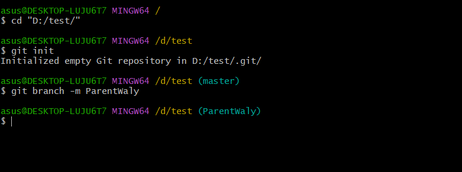
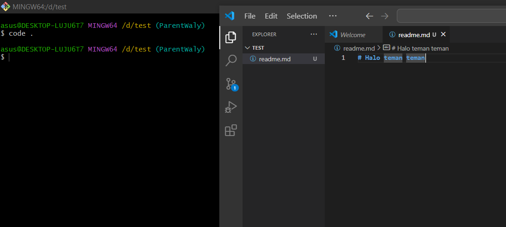
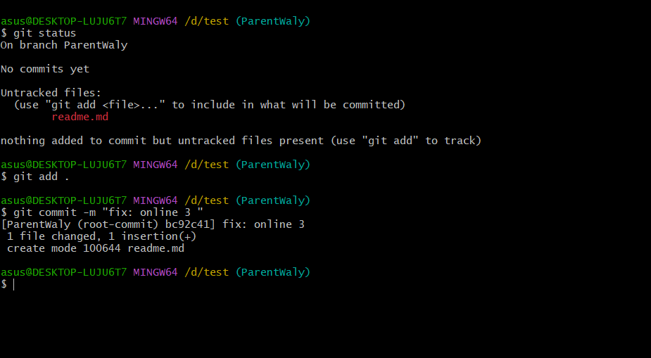
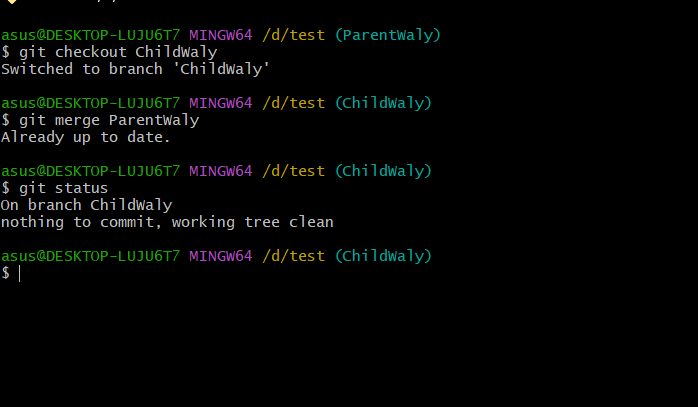
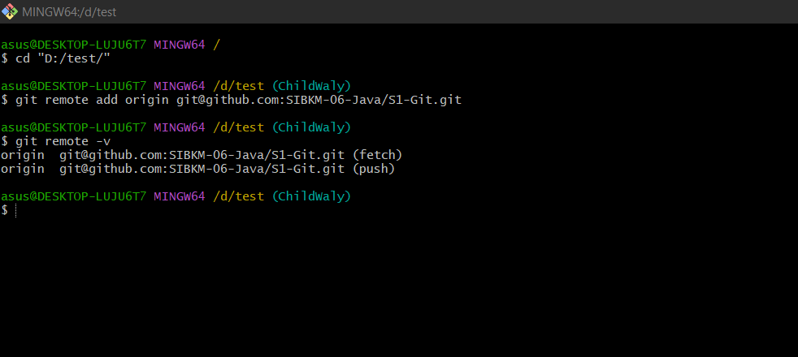
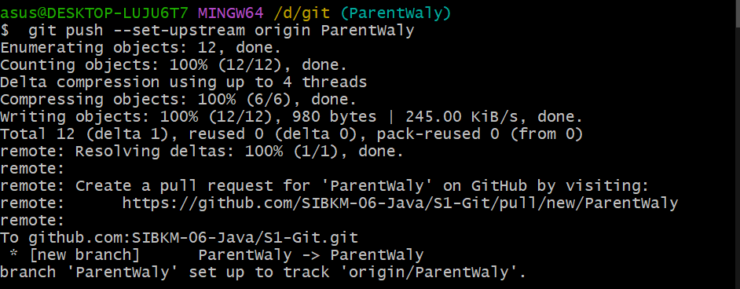
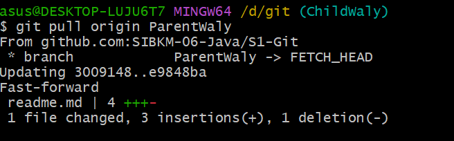
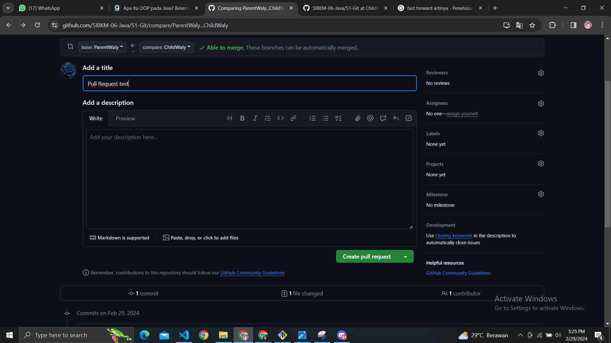
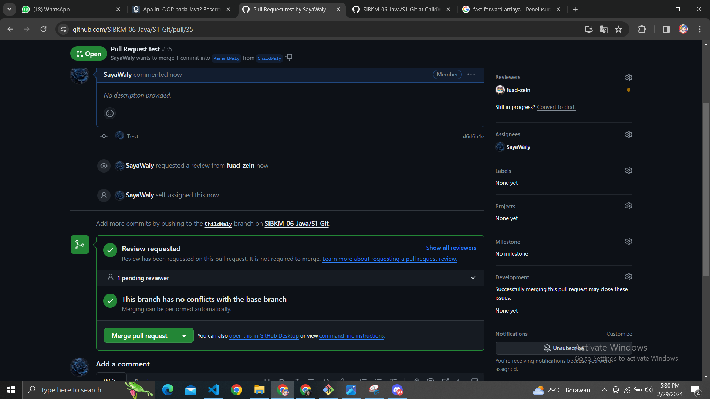
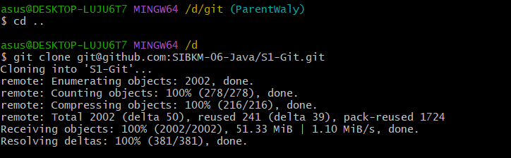

# Halo Teman Teman

## Semangat...

## fast forward example - text 1

## pasti dong

## Three way merge

## mencoba PR yang di sarankan

### test

# Step 1 
Pertama tama membuat floder lalu memasukan folder tersebut ke repo git

# Step 2
membuat file di vscode dll

# Step 3
meng add file dan mencommit file readme.md untuk dimasukan ke repo

# Step 4
membuat satu file baru lalu masuk ke file baru di buat dan menggambungkan data supaya sama "menggabungkan data dengan cara yang tidak di sarankan ka fuad"

# Step 5
Membuat remote yang nantinya untuk memasukkan data yang awalnya di stage ke repo web git

# Step 6
mempush data local ke web git hub

# Step 7
membuat data tentang three way mergen lalu data itu harus di fix dulu biar tidak terjadi konflik di ke dua data "node tadi lupa ss jadi tidak ada gambar"

# Step 8 
mengambil data dari repo dengan cara pull cara ini tidak bisa bila terjadi konflik data

# Step 9
membuat PR di web

# Step 10
melakukan merge di web dengan tambahan ada atasan dan bawahan untuk menconfirm data tersebut

# Step 11
melakukan clone data inti untuk menambahkan data lagi
