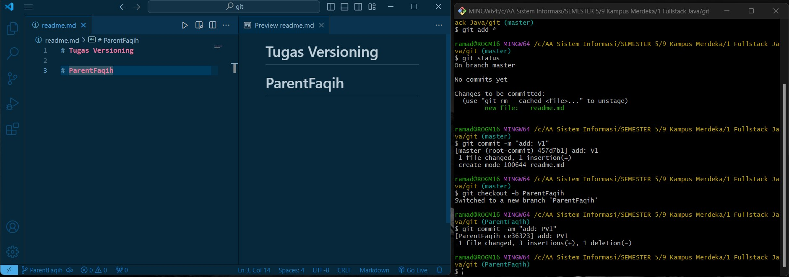
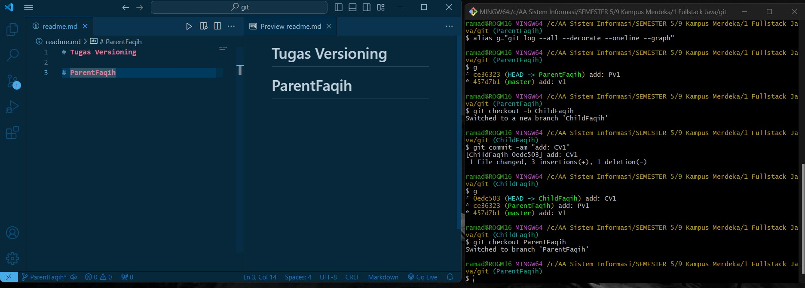
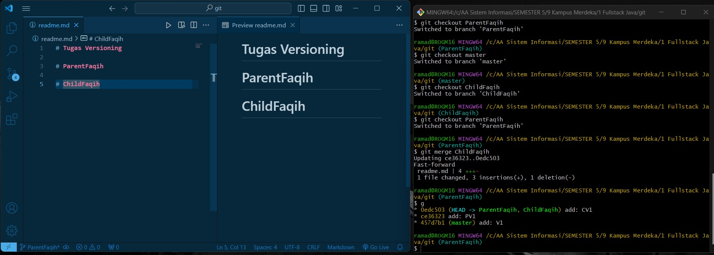
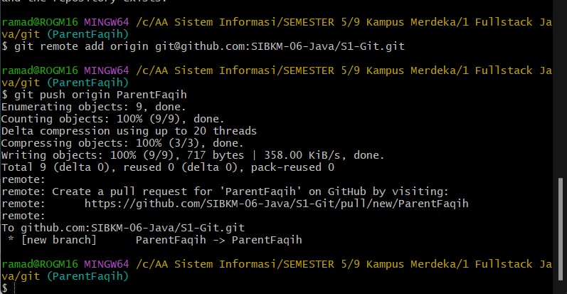
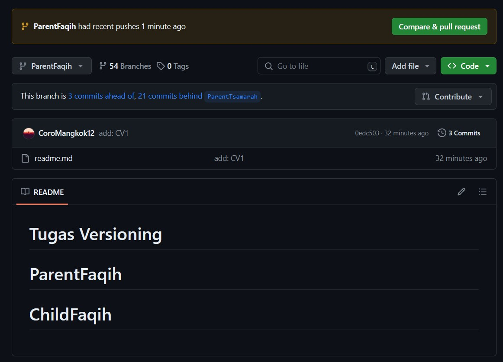

# Tugas Versioning

# ParentFaqih

# ChildFaqih

Fast Forward

1. init pada folder baru yang telah dibuat

2. tambahkan file ke staging area

3. commit pertama di branch master

4. membuat branch parent dan menuliskan script di vscode

5. commit kedua di branch Parent

6. graphs semua branch

7. membuat branch child dan menuliskan script

8. melakukan merge pada parent karena script pada child tidak muncul

9. menghubungkan dengan github

10. hasil akhir

