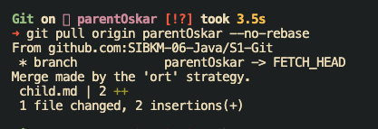

Testing

## Oskar Maha Kasi

## Fast Forward Merge

#### Langkah 1

Buat folder baru lalu git init

#### Langkah 2

Buat file readme.md lalu git add .

#### Langkah 3

Commit perubahan

#### Langkah 4

Push perubahan ke branch parentOskar

#### Langkah 5

Membuat branch baru (childOskar branch) yang nantinya di-merge ke parent branch dengan cara
`git checkout -b childOskar` lalu saya tambahkan file child.md

#### Langkah 6

Kembali ke branch parentOskar dengan cara
`git checkout parentOskar`

#### Langkah 8

Setelah berada di parentOskar, lakukan merge dengan command `git merge childOskar`

lalu saya push ke parentOskar dengan command `git push origin parnetOskar`

## Three Way Merge

1. Clone branch parentOskar sebelum perubahan
2. Selanjutnya pada clone ubah file child.md
3. `git add .` perubahan tersebut lalu `git commit -m '[feature] try conflict'`
   
4. Push perubahan ke branch parentOskar dengan `git push origin parentOskar`
   
5. Selanjutnya coba commit & push perubahan pada branchParentOskar setelah diubah dari source code lain
6. Maka terjadi conflict yang mengharuskan pull terlebih dahulu
   
7. Lakukan pull `git pull origin parentOskar --no-rebase` untuk merge sehingga mendapatkan source code perubahan
   
8. Exit merge editornya dengan menuliskan `:q` lalu enter sehingga berhasil merge
   
