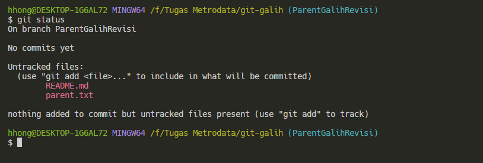
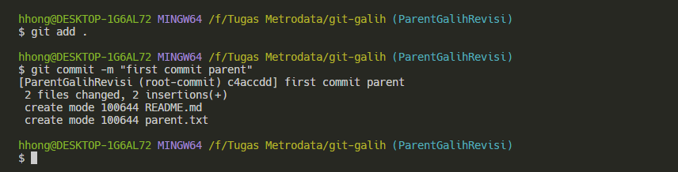
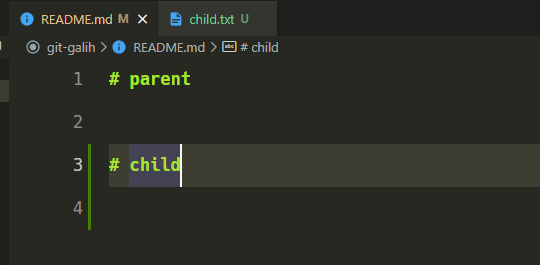
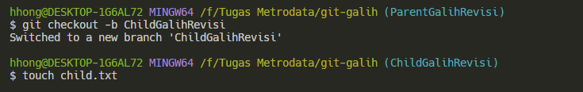
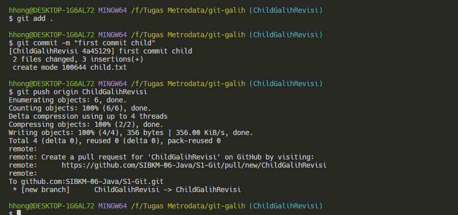
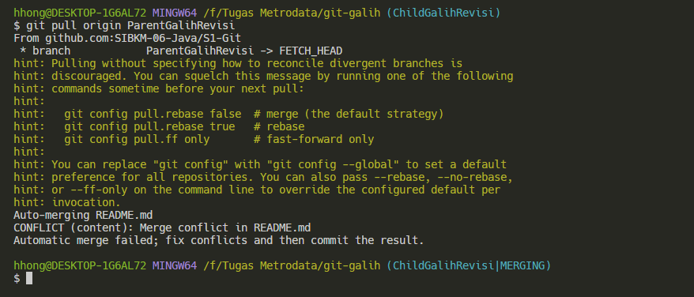
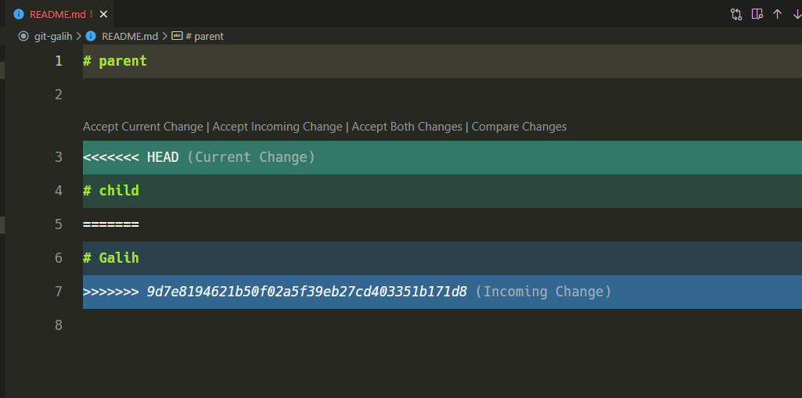
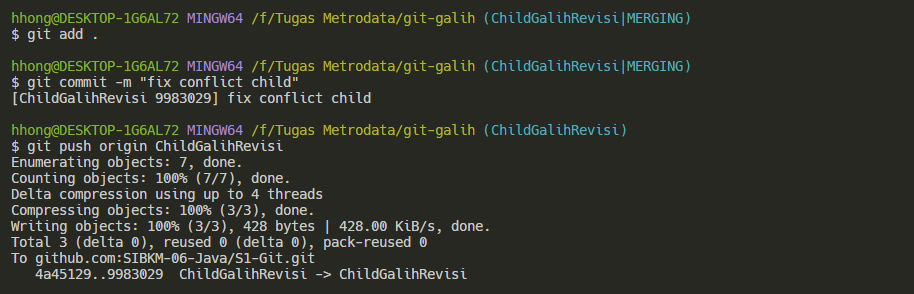
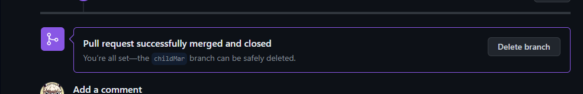

# 
 Tugas 1

 Versioning

 Anggi Marselino 

 Studi Independen Bersertifikat Kampus Merdeka Batch 6 

 2024

# Fast Forward

1. Pembuatan Folder Project , File README.md , Inisialisasi repostory , pembuatan parent brnach dan adding readme.md ke repostory.

  

2. Pembuatan Child branch dan adding readme.md ke repostory.

  

3. Pembuatan alias graph untuk menampilkan Log.

  

4. Melakukan koneksi ke repository GitHub. 

  

5. Melakukan Push 

  

6.Melakukan Merge parentMar dengan childMar.

  

TREE WAY MERGE

7. Membuat Folder dan Melakukan Clone Terhadap git@github.com:SIBKM-06-Java/S1-Git.git

  

  
8.Melakukan Perubahan Pada Parent.

  

9. Melakukan commit dan push pada childMar.

  

10.Melakukan Pull pada pada parentMar di childMar.

  

11.Melakukan Merge Both Changes.

  

  

12.Melakukan Commit setelah file di merge.

  

13.Melakukan Pull Request.

  

  

14.Melakukan Merge pull request.

  

  

15.Penghapusan ChildMar.

  

16.Melakukan Pull parentMar agar terupdate.

  

