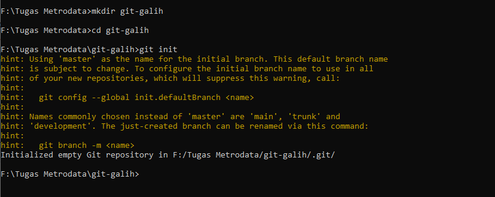
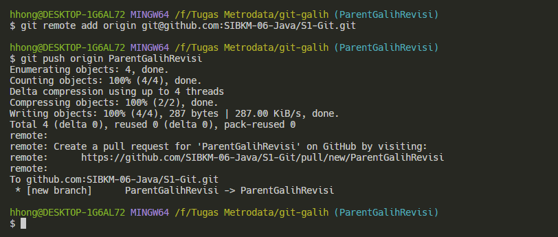

# 
 Tugas 1

 Versioning

 Anggi Marselino 

 Studi Independen Bersertifikat Kampus Merdeka Batch 6 

 2024

# Fast Forward

1. Pembuatan Folder Project , File README.md , Inisialisasi repostory , pembuatan parent brnach dan adding readme.md ke repostory.

  

2. Pembuatan Child branch dan adding readme.md ke repostory.

  

3. Pembuatan alias graph untuk menampilkan Log.

  

4. Melakukan koneksi ke repository GitHub. 

  

5. Melakukan Push 

  

6.Melakukan Merge parentMar dengan childMar.

  

7. Melakukan Clone Terhadap git@github.com:SIBKM-06-Java/S1-Git.git

  

